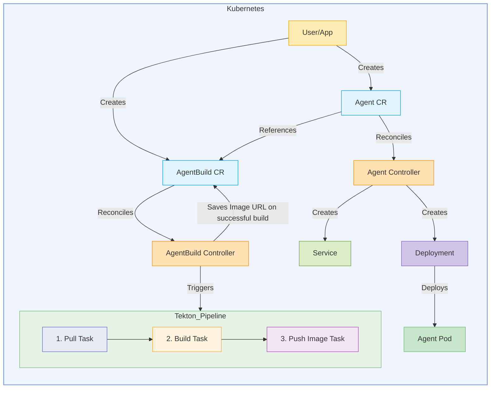

# Kagenti Operator

[](LICENSE)


**Kagenti Operator** is a Kubernetes operator that automates the complete lifecycle management of AI agents, from building container images from source code to deploying and managing them in Kubernetes clusters.

## Overview

The Kagenti Operator simplifies AI agent deployment by managing two Custom Resource Definitions (CRDs):

| Resource | Purpose |
|----------|---------|
| **[Agent](./docs/api-reference.md#agent)** | Deploys and manages AI agent workloads from container images or source code |
| **[AgentBuild](./docs/api-reference.md#agentbuild)** | Builds container images from GitHub repositories using Tekton pipelines |

### Key Features

- **Deploy from Image or Source** — Use pre-built container images or build directly from GitHub repositories
- **Automated Build Pipelines** — Integrated Tekton pipelines with support for Dockerfile and Cloud Native Buildpacks
- **Flexible Configuration** — Complete control over pod specifications, service ports, and environment variables
- **Security Built-in** — Support for private registries, secret management, and RBAC
- **Multi-Framework Support** — Works with LangGraph, CrewAI, AG2, and any A2A-compatible framework

## Architecture



The operator separates build and deployment concerns:
- **Agent CR** manages deployment lifecycle and runtime configuration
- **AgentBuild CR** orchestrates the build process using Tekton pipelines

## Quick Start

### Prerequisites

- Kubernetes cluster (v1.28+)
- kubectl configured to access your cluster
- Tekton Pipelines installed (for building from source)
- Container registry access (for building from source)

### Install the Operator

Using Helm:

```bash
# Install the operator using OCI chart
helm install kagenti-operator \
  oci://ghcr.io/kagenti/kagenti-operator/kagenti-operator-chart \
  --version 0.2.0-alpha.19 \
  --namespace kagenti-system \
  --create-namespace
```

### Deploy Your First Agent

**Option 1: From an existing container image**

```bash
kubectl apply -f - <<EOF
apiVersion: agent.kagenti.dev/v1alpha1
kind: Agent
metadata:
  name: my-agent
  namespace: default
spec:
  imageSource:
    image: "ghcr.io/kagenti/agent-examples/weather_service:v0.0.1-alpha.3"
  servicePorts:
    - port: 8000
      targetPort: 8000
      protocol: TCP
      name: http
  podTemplateSpec:
    spec:
      containers:
      - name: agent
        ports:
        - containerPort: 8000
        env:
        - name: PORT
          value: "8000"
EOF
```

**Option 2: Build from source code**

```bash
# First, create a build
kubectl apply -f - <<EOF
apiVersion: agent.kagenti.dev/v1alpha1
kind: AgentBuild
metadata:
  name: my-agent-build
  namespace: default
spec:
  mode: dev
  source:
    sourceRepository: "github.com/myorg/my-agent.git"
    sourceRevision: "main"
    sourceCredentials:
      name: github-token-secret
  buildOutput:
    image: "my-agent"
    imageTag: "v1.0.0"
    imageRegistry: "ghcr.io/myorg"
    imageRepoCredentials:
      name: ghcr-secret
EOF

# Then, deploy using the build
kubectl apply -f - <<EOF
apiVersion: agent.kagenti.dev/v1alpha1
kind: Agent
metadata:
  name: my-agent
  namespace: default
spec:
  imageSource:
    buildRef:
      name: my-agent-build
  servicePorts:
    - port: 8000
      targetPort: 8000
      protocol: TCP
      name: http
  podTemplateSpec:
    spec:
      containers:
      - name: agent
        ports:
        - containerPort: 8000
EOF
```

### Verify Deployment

```bash
# Check agent status
kubectl get agents

# Check agent build status
kubectl get agentbuilds

# View agent logs
kubectl logs -l app.kubernetes.io/name=my-agent
```

## Documentation

| Topic | Link |
|-------|------|
| **API Reference** | [CRD Specifications & Examples](./docs/api-reference.md) |
| **Architecture** | [Operator Design & Components](./docs/architecture.md) |
| **Developer Guide** | [Contributing & Development](./docs/dev.md) |
| **Getting Started** | [Detailed Tutorials](./GETTING_STARTED.md) |

## Examples

See the [config/samples](./config/samples) directory for complete examples:

- [weather-agent-image-deployment.yaml](./config/samples/weather-agent-image-deployment.yaml) — Deploy from existing image
- [weather-agent-build-and-deploy.yaml](./config/samples/weather-agent-build-and-deploy.yaml) — Build and deploy from source
- [helloworld-build-and-deploy-no-dockerfile.yaml](./config/samples/helloworld-build-and-deploy-no-dockerfile.yaml) — Use Cloud Native Buildpacks

## Contributing

We welcome contributions! See [CONTRIBUTING.md](../CONTRIBUTING.md) for guidelines on:

- Reporting issues
- Submitting pull requests
- Development setup
- Testing requirements

## License

[Apache 2.0](LICENSE)
