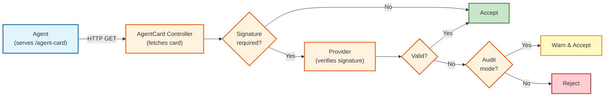

# A2A AgentCard Signature Verification Setup Guide

**GitHub Issue:** [#116 - Feature: Strict CardSignature Checking](https://github.com/kagenti/kagenti-operator/issues/116)

This guide walks you through setting up A2A AgentCard signature verification. By the end, you'll have a working system where only agents with **cryptographically signed AgentCards** can communicate.

> **Note:** Signature verification and identity binding work together. When both are configured, an agent must pass **both** checks to get network access. Signature alone works if identity binding is not configured.

---

## Table of Contents

1. [Overview](#1-overview)
2. [Prerequisites](#2-prerequisites)
3. [Architecture](#3-architecture)
4. [Setup](#4-setup)
5. [Demo Scenarios](#5-demo-scenarios)
6. [Troubleshooting](#6-troubleshooting)
7. [Reference](#7-reference)
8. [Cleanup](#8-cleanup)

---

## 1. Overview

**Kagenti Operator** is a Kubernetes operator that manages AI agents following the [A2A Protocol](https://a2a-protocol.org/). Agents discover each other by publishing an **AgentCard** (a JSON document describing the agent's capabilities).

### What Signature Verification Provides

| Without Signature Verification | With Signature Verification |
|--------------------------------|----------------------------|
| Any pod can claim to be any agent | Only agents with cards signed by your private key are accepted |

### Key Features

- **JWS signatures**: RSA and ECDSA using JWS Compact Serialization (RFC 7515) with canonical JSON payload
- **Multiple providers**: Kubernetes Secrets or JWKS endpoints
- **Audit mode**: Log failures without blocking agents
- **NetworkPolicy enforcement**: Network-level isolation of unverified agents
- **Zero-downtime key rotation**: Rotate signing keys without disrupting running agents
- **Prometheus metrics**: Counters, histograms, and error tracking

---

## 2. Prerequisites

| Tool | Version | Verify |
|------|---------|--------|
| kubectl | v1.28+ | `kubectl version --client` |
| helm | v3.0+ | `helm version` |
| openssl | any | `openssl version` |
| python3 | 3.8+ | `python3 --version` |
| Docker/Podman | any | `docker version` |

**Python packages** (for signing):
```bash
pip3 install cryptography
```

**Kubernetes cluster options:**
- **Local:** kind, minikube, k3d, or Docker Desktop
- **Cloud:** EKS, GKE, AKS, OpenShift

**Clone the repository:**

```bash
git clone https://github.com/kagenti/kagenti-operator.git
cd kagenti-operator
```

> All commands assume you're in the `kagenti-operator` directory.

---

## 3. Architecture

### High-Level Flow



### Signature Format (JWS)

The operator verifies signatures embedded in the AgentCard JSON using **JWS JSON Serialization** (A2A spec §8.4.2):

```json
{
  "name": "My Agent",
  "url": "http://my-agent:8000",
  "signatures": [
    {
      "protected": "eyJhbGciOiJSUzI1NiIsImtpZCI6Im15LXNpZ25pbmcta2V5IiwidHlwIjoiSk9TRSJ9",
      "signature": "base64url-encoded-JWS-signature"
    }
  ]
}
```

The `protected` field is a base64url-encoded JSON header containing:
- `alg`: signature algorithm (e.g., `RS256`, `ES256`)
- `kid`: key identifier matching a key in the Secret/JWKS
- `typ`: `JOSE` (required by A2A spec)
- `spiffe_id`: optional SPIFFE identity of the signer (for identity binding)

Verification steps:
1. Decode the JWS protected header → extract `alg`, `kid`, `spiffe_id`
2. Validate the algorithm (reject `none`, verify key type matches)
3. Strip the `signatures` field from the card → create **canonical JSON** (sorted keys, no whitespace)
4. Reconstruct signing input: `BASE64URL(protected) || '.' || BASE64URL(canonical_payload)`
5. Verify the cryptographic signature against the public key

### Component Responsibilities

| Component | Code Location |
|-----------|---------------|
| AgentCardReconciler | `internal/controller/agentcard_controller.go` |
| Provider Interface | `internal/signature/provider.go` |
| Secret Provider | `internal/signature/secret.go` |
| JWKS Provider | `internal/signature/jwks.go` |
| Verifier (core crypto) | `internal/signature/verifier.go` |
| NetworkPolicy Controller | `internal/controller/agentcard_networkpolicy_controller.go` |
| Metrics | `internal/signature/metrics.go` |

---

## 4. Setup

### Step 1: Install Dependencies

```bash
# Create cluster (skip if you have one)
kind create cluster --name kagenti-demo

# Install cert-manager (for webhook certificates)
kubectl apply -f https://github.com/cert-manager/cert-manager/releases/download/v1.16.2/cert-manager.yaml
kubectl wait --for=condition=Available deployment/cert-manager -n cert-manager --timeout=120s
```

### Step 2: Generate Keys and Create Secret

```bash
# Generate RSA key pair
openssl genrsa -out private-key.pem 2048
openssl rsa -in private-key.pem -pubout -out public-key.pem

# Create namespace and secret
kubectl create namespace kagenti-system
kubectl label namespace kagenti-system control-plane=kagenti-operator
kubectl create secret generic a2a-public-keys \
  --from-file=public.pem=public-key.pem \
  --from-file=my-signing-key=public-key.pem \
  --namespace=kagenti-system
```

> ⚠️ **Security:** Keep `private-key.pem` secure. Never commit it to git.

### Step 3: Install Kagenti Operator

```bash
# Build the operator (runs in a subshell so we stay in the repo root)
(cd kagenti-operator && make docker-build IMG=kagenti-operator:dev)
kind load docker-image kagenti-operator:dev --name kagenti-demo

kubectl create namespace kagenti-system 2>/dev/null || true
helm install kagenti-operator charts/kagenti-operator \
  --namespace kagenti-system \
  --set signatureVerification.enabled=true \
  --set signatureVerification.provider=secret \
  --set signatureVerification.secret.name=a2a-public-keys \
  --set signatureVerification.secret.namespace=kagenti-system \
  --set controllerManager.container.image.repository=kagenti-operator \
  --set controllerManager.container.image.tag=dev \
  --set controllerManager.container.cmd=/manager

# Verify
kubectl wait --for=condition=Available deployment/kagenti-controller-manager \
  -n kagenti-system --timeout=120s
kubectl logs -n kagenti-system deployment/kagenti-controller-manager | grep -i signature
```

> **Note:** `--set controllerManager.container.cmd=/manager` is required for locally-built images. Production releases use `/ko-app/cmd`.

### Step 4: Sign and Deploy an Agent

The repository includes a JWS signing script at `kagenti-operator/scripts/sign-agent-card.py`. It produces signatures conforming to A2A spec §8.4.2.

**Sign and deploy:**

```bash
# Create unsigned card
cat > my-agent-card.json << 'EOF'
{
  "name": "Weather Agent",
  "description": "Provides weather information for any location",
  "version": "1.0.0",
  "url": "http://weather-agent.default.svc.cluster.local:8000",
  "capabilities": {"streaming": true, "pushNotifications": false},
  "defaultInputModes": ["text/plain"],
  "defaultOutputModes": ["application/json"]
}
EOF

# Sign with private key (JWS format)
python3 kagenti-operator/scripts/sign-agent-card.py my-agent-card.json private-key.pem \
  --key-id my-signing-key --output signed-agent-card.json

# Create ConfigMap from signed card
cat > weather-agent-configmap.yaml << EOF
apiVersion: v1
kind: ConfigMap
metadata:
  name: weather-agent-card
  namespace: default
data:
  agent.json: |
$(cat signed-agent-card.json | sed 's/^/    /')
EOF

kubectl apply -f weather-agent-configmap.yaml

# Deploy Deployment + Service + AgentCard (targetRef)
cat <<EOF | kubectl apply -f -
apiVersion: apps/v1
kind: Deployment
metadata:
  name: weather-agent
  namespace: default
  labels:
    app.kubernetes.io/name: weather-agent
    kagenti.io/type: agent
    kagenti.io/protocol: a2a
spec:
  replicas: 1
  selector:
    matchLabels:
      app.kubernetes.io/name: weather-agent
  template:
    metadata:
      labels:
        app.kubernetes.io/name: weather-agent
        kagenti.io/type: agent
        kagenti.io/protocol: a2a
    spec:
      initContainers:
      - name: setup-agentcard
        image: python:3.11-slim
        command: ["sh", "-c", "mkdir -p /app/.well-known && cp /data/agent.json /app/.well-known/agent.json"]
        volumeMounts:
        - name: card
          mountPath: /data
          readOnly: true
        - name: app-dir
          mountPath: /app
      containers:
      - name: agent
        image: python:3.11-slim
        command: ["python3", "-m", "http.server", "8000"]
        workingDir: /app
        volumeMounts:
        - name: app-dir
          mountPath: /app
      volumes:
      - name: card
        configMap:
          name: weather-agent-card
      - name: app-dir
        emptyDir: {}
---
apiVersion: v1
kind: Service
metadata:
  name: weather-agent
  namespace: default
spec:
  selector:
    app.kubernetes.io/name: weather-agent
  ports:
  - name: http
    port: 8000
    targetPort: 8000
---
apiVersion: agent.kagenti.dev/v1alpha1
kind: AgentCard
metadata:
  name: weather-agent-card
  namespace: default
spec:
  syncPeriod: "30s"
  targetRef:
    apiVersion: apps/v1
    kind: Deployment
    name: weather-agent
EOF

kubectl wait --for=condition=Available deployment/weather-agent --timeout=120s
kubectl wait --for=jsonpath='.status.lastSyncTime' agentcard/weather-agent-card --timeout=60s
```

### Step 5: Verify Signature Verification

```bash
kubectl get agentcard weather-agent-card -o wide
kubectl get agentcard weather-agent-card -o jsonpath='{.status.validSignature}'
```

**Expected:** `VERIFIED=true`, `validSignature=true`

```yaml
status:
  validSignature: true
  signatureVerificationDetails: "JWS signature verified successfully (alg=RS256, kid=my-signing-key)"
  signatureKeyId: "my-signing-key"
  signatureSpiffeId: ""            # empty unless --spiffe-id was used during signing
  signatureIdentityMatch: null     # only set when identityBinding is configured in spec
```

**Setup complete.** The AgentCard signature is verified against the public key in the secret.

---

## 5. Demo Scenarios

All demos build on the `weather-agent` from Setup.

### Demo 1: Unsigned Card (Rejected)

Deploy an agent with no signature — it should be rejected:

```bash
cat > unsigned-card.json << 'EOF'
{
  "name": "Rogue Agent",
  "description": "No signature",
  "version": "1.0.0",
  "url": "http://rogue-agent.default.svc.cluster.local:8000",
  "capabilities": {"streaming": false, "pushNotifications": false},
  "defaultInputModes": ["text/plain"],
  "defaultOutputModes": ["application/json"]
}
EOF

cat > rogue-configmap.yaml << EOF
apiVersion: v1
kind: ConfigMap
metadata:
  name: rogue-agent-card
  namespace: default
data:
  agent.json: |
$(cat unsigned-card.json | sed 's/^/    /')
EOF

kubectl apply -f rogue-configmap.yaml
cat <<EOF | kubectl apply -f -
apiVersion: apps/v1
kind: Deployment
metadata:
  name: rogue-agent
  namespace: default
  labels:
    app.kubernetes.io/name: rogue-agent
    kagenti.io/type: agent
    kagenti.io/protocol: a2a
spec:
  replicas: 1
  selector:
    matchLabels:
      app.kubernetes.io/name: rogue-agent
  template:
    metadata:
      labels:
        app.kubernetes.io/name: rogue-agent
        kagenti.io/type: agent
        kagenti.io/protocol: a2a
    spec:
      initContainers:
      - name: setup-agentcard
        image: python:3.11-slim
        command: ["sh", "-c", "mkdir -p /app/.well-known && cp /data/agent.json /app/.well-known/agent.json"]
        volumeMounts:
        - {name: card, mountPath: /data, readOnly: true}
        - {name: app-dir, mountPath: /app}
      containers:
      - name: agent
        image: python:3.11-slim
        command: ["python3", "-m", "http.server", "8000"]
        workingDir: /app
        volumeMounts:
        - {name: app-dir, mountPath: /app}
      volumes:
      - name: card
        configMap: {name: rogue-agent-card}
      - name: app-dir
        emptyDir: {}
---
apiVersion: v1
kind: Service
metadata:
  name: rogue-agent
  namespace: default
spec:
  selector:
    app.kubernetes.io/name: rogue-agent
  ports:
  - name: http
    port: 8000
    targetPort: 8000
---
apiVersion: agent.kagenti.dev/v1alpha1
kind: AgentCard
metadata:
  name: rogue-agent-card
  namespace: default
spec:
  syncPeriod: "30s"
  targetRef:
    apiVersion: apps/v1
    kind: Deployment
    name: rogue-agent
EOF

kubectl wait --for=condition=Available deployment/rogue-agent --timeout=120s
kubectl wait --for=jsonpath='.status.lastSyncTime' agentcard/rogue-agent-card --timeout=60s
kubectl get agentcard -o wide
```

**Expected:** `weather-agent-card` is `VERIFIED=true`, `rogue-agent-card` is `VERIFIED=false`.

```bash
kubectl get agentcard rogue-agent-card -o jsonpath='{.status.signatureVerificationDetails}'
# "AgentCard does not contain any signatures"
```

---

### Demo 2: Wrong-Key Signature (Rejected)

Sign a card with a **different** private key — the signature won't match the public key in the secret:

```bash
# Generate a different key pair
openssl genrsa -out wrong-private-key.pem 2048

# Sign with the wrong key (keyId still says "my-signing-key")
cat > tampered-card.json << 'EOF'
{
  "name": "Tampered Agent",
  "description": "Signed with wrong key",
  "version": "1.0.0",
  "url": "http://tampered-agent.default.svc.cluster.local:8000",
  "capabilities": {"streaming": false, "pushNotifications": false},
  "defaultInputModes": ["text/plain"],
  "defaultOutputModes": ["application/json"]
}
EOF
python3 kagenti-operator/scripts/sign-agent-card.py tampered-card.json wrong-private-key.pem \
  --key-id my-signing-key --output tampered-signed.json

cat > tampered-configmap.yaml << EOF
apiVersion: v1
kind: ConfigMap
metadata:
  name: tampered-agent-card
  namespace: default
data:
  agent.json: |
$(cat tampered-signed.json | sed 's/^/    /')
EOF

kubectl apply -f tampered-configmap.yaml
cat <<EOF | kubectl apply -f -
apiVersion: apps/v1
kind: Deployment
metadata:
  name: tampered-agent
  namespace: default
  labels:
    app.kubernetes.io/name: tampered-agent
    kagenti.io/type: agent
    kagenti.io/protocol: a2a
spec:
  replicas: 1
  selector:
    matchLabels:
      app.kubernetes.io/name: tampered-agent
  template:
    metadata:
      labels:
        app.kubernetes.io/name: tampered-agent
        kagenti.io/type: agent
        kagenti.io/protocol: a2a
    spec:
      initContainers:
      - name: setup-agentcard
        image: python:3.11-slim
        command: ["sh", "-c", "mkdir -p /app/.well-known && cp /data/agent.json /app/.well-known/agent.json"]
        volumeMounts:
        - {name: card, mountPath: /data, readOnly: true}
        - {name: app-dir, mountPath: /app}
      containers:
      - name: agent
        image: python:3.11-slim
        command: ["python3", "-m", "http.server", "8000"]
        workingDir: /app
        volumeMounts:
        - {name: app-dir, mountPath: /app}
      volumes:
      - name: card
        configMap: {name: tampered-agent-card}
      - name: app-dir
        emptyDir: {}
---
apiVersion: v1
kind: Service
metadata:
  name: tampered-agent
  namespace: default
spec:
  selector:
    app.kubernetes.io/name: tampered-agent
  ports:
  - name: http
    port: 8000
    targetPort: 8000
---
apiVersion: agent.kagenti.dev/v1alpha1
kind: AgentCard
metadata:
  name: tampered-agent-card
  namespace: default
spec:
  syncPeriod: "30s"
  targetRef:
    apiVersion: apps/v1
    kind: Deployment
    name: tampered-agent
EOF

kubectl wait --for=condition=Available deployment/tampered-agent --timeout=120s
kubectl wait --for=jsonpath='.status.lastSyncTime' agentcard/tampered-agent-card --timeout=60s
kubectl get agentcard -o wide
```

**Expected:** `tampered-agent-card` is `VERIFIED=false`, `signatureVerificationDetails: "JWS signature verification failed with all available keys"`.

---

### Demo 3: Audit Mode

Enable audit mode — invalid signatures are **accepted with warnings** instead of blocked:

```bash
helm upgrade kagenti-operator charts/kagenti-operator \
  --namespace kagenti-system \
  --set signatureVerification.enabled=true \
  --set signatureVerification.provider=secret \
  --set signatureVerification.secret.name=a2a-public-keys \
  --set signatureVerification.secret.namespace=kagenti-system \
  --set signatureVerification.auditMode=true \
  --set controllerManager.container.image.repository=kagenti-operator \
  --set controllerManager.container.image.tag=dev \
  --set controllerManager.container.cmd=/manager

# Wait for rollout
kubectl rollout status deployment/kagenti-controller-manager -n kagenti-system --timeout=120s
kubectl get agentcard -o wide
```

**Expected:**

| Agent | VERIFIED | SYNCED | Behavior |
|-------|----------|--------|----------|
| `weather-agent-card` | `true` | `True` | Valid signature accepted |
| `rogue-agent-card` | `true` | `True` | No signatures, audit mode: allowed |
| `tampered-agent-card` | `true` | `True` | Wrong key, audit mode: allowed |

```bash
# Check audit mode logs
kubectl logs -n kagenti-system deployment/kagenti-controller-manager | grep -i "audit mode"
```

> **Key Takeaway:** Audit mode is ideal for rolling out signature verification gradually — monitor failures before enforcing.

---

### Demo 4: NetworkPolicy Enforcement

Enable network-level blocking of unverified agents:

```bash
helm upgrade kagenti-operator charts/kagenti-operator \
  --namespace kagenti-system \
  --set signatureVerification.enabled=true \
  --set signatureVerification.provider=secret \
  --set signatureVerification.secret.name=a2a-public-keys \
  --set signatureVerification.secret.namespace=kagenti-system \
  --set signatureVerification.enforceNetworkPolicies=true \
  --set controllerManager.container.image.repository=kagenti-operator \
  --set controllerManager.container.image.tag=dev \
  --set controllerManager.container.cmd=/manager

# Wait for rollout
kubectl rollout status deployment/kagenti-controller-manager -n kagenti-system --timeout=120s

# Verify NetworkPolicies created
kubectl get networkpolicy -n default

# Check operator logs
kubectl logs -n kagenti-system deployment/kagenti-controller-manager | grep -i "networkpolicy\|restrictive\|permissive"
```

**Expected:**
- Verified agents → **permissive** NetworkPolicy (traffic allowed)
- Unverified agents → **restrictive** NetworkPolicy (traffic blocked)

> **Note:** The JWKS endpoint must serve a standard [RFC 7517](https://datatracker.ietf.org/doc/html/rfc7517) JSON Web Key Set. Each key must have a `kid` that matches the `kid` in the JWS protected header.

---

### Demo 5: JWKS Provider

Use a JWKS endpoint instead of Kubernetes Secrets:

```bash
helm upgrade kagenti-operator charts/kagenti-operator \
  --namespace kagenti-system \
  --set signatureVerification.enabled=true \
  --set signatureVerification.provider=jwks \
  --set signatureVerification.jwks.url=https://your-domain.com/.well-known/jwks.json \
  --set controllerManager.container.image.repository=kagenti-operator \
  --set controllerManager.container.image.tag=dev \
  --set controllerManager.container.cmd=/manager

# Wait for rollout
kubectl rollout status deployment/kagenti-controller-manager -n kagenti-system --timeout=120s
kubectl get agentcard -o wide
kubectl logs -n kagenti-system deployment/kagenti-controller-manager | grep -i jwks
```

**Expected:** Operator fetches keys from the JWKS endpoint and verifies signatures identically to the Secret provider.

---

### Demo 6: Key Rotation (Zero Downtime)

Rotate signing keys without disrupting running agents:

```bash
# Step 1: Generate new key pair
openssl genrsa -out new-private-key.pem 2048
openssl rsa -in new-private-key.pem -pubout -out new-public-key.pem

# Step 2: Add both old and new keys to secret
kubectl create secret generic a2a-public-keys \
  --from-file=old-key=public-key.pem \
  --from-file=new-key=new-public-key.pem \
  --namespace=kagenti-system \
  --dry-run=client -o yaml | kubectl apply -f -
kubectl rollout restart deployment/kagenti-controller-manager -n kagenti-system
kubectl rollout status deployment/kagenti-controller-manager -n kagenti-system --timeout=120s

# Verify: agent signed with OLD key still passes
kubectl get agentcard weather-agent-card -o wide
# Expected: VERIFIED=true (old key still in secret)

# Step 3: Re-sign agents with new key
python3 kagenti-operator/scripts/sign-agent-card.py my-agent-card.json new-private-key.pem \
  --key-id new-key --output signed-agent-card.json
cat > weather-agent-configmap.yaml << EOF
apiVersion: v1
kind: ConfigMap
metadata:
  name: weather-agent-card
  namespace: default
data:
  agent.json: |
$(cat signed-agent-card.json | sed 's/^/    /')
EOF
kubectl apply -f weather-agent-configmap.yaml
kubectl rollout restart deployment/weather-agent -n default
kubectl rollout status deployment/weather-agent -n default --timeout=120s

# Verify: agent now uses new key
kubectl get agentcard weather-agent-card -o jsonpath='{.status.signatureKeyId}'
# Expected: "new-key"

# Step 4: Remove old key after all agents migrated
kubectl delete secret a2a-public-keys -n kagenti-system
kubectl create secret generic a2a-public-keys \
  --from-file=new-key=new-public-key.pem \
  --namespace=kagenti-system
kubectl rollout restart deployment/kagenti-controller-manager -n kagenti-system
kubectl rollout status deployment/kagenti-controller-manager -n kagenti-system --timeout=120s

# Verify: agent still passes with only new key
kubectl get agentcard weather-agent-card -o wide
# Expected: VERIFIED=true
```

> **Key Takeaway:** Always have a transition period where both keys are active. Never remove the old key until all agents are re-signed.

---

## 6. Troubleshooting

| Issue | Cause | Solution |
|-------|-------|----------|
| `"AgentCard does not contain any signatures"` | AgentCard JSON has no `signatures` array | Sign the card using `kagenti-operator/scripts/sign-agent-card.py` |
| `"key not found in secret"` | `kid` in JWS header doesn't match any key in secret | Verify key names: `kubectl get secret a2a-public-keys -n kagenti-system -o jsonpath='{.data}' \| jq` |
| `"JWS signature verification failed"` | Signature doesn't match card content | Ensure correct private key and card hasn't changed after signing |
| `"Algorithm validation failed"` | Unsupported or missing `alg` in JWS header | Check signing script uses `RS256`, `ES256`, or another supported algorithm |
| `"Algorithm mismatch"` | JWS header `alg` doesn't match public key type | Ensure RSA key with `RS256` or ECDSA key with `ES256` |
| `"failed to fetch secret"` | RBAC permissions issue | Check: `kubectl auth can-i get secrets -n kagenti-system --as=system:serviceaccount:kagenti-system:kagenti-controller-manager` |
| AgentCard stuck in Pending | Agent pod not serving card | Check pod: `kubectl get pods -l app.kubernetes.io/name=weather-agent` |

**Debug commands:**

```bash
# Check operator logs
kubectl logs -n kagenti-system deployment/kagenti-controller-manager | grep -i "verif\|signature"

# Check AgentCard status
kubectl get agentcard <name> -o yaml

# Check NetworkPolicies
kubectl get networkpolicy -n <namespace>
```

---

## 7. Reference

### Helm Values

| Parameter | Description | Default |
|-----------|-------------|---------|
| `signatureVerification.enabled` | Enable signature verification | `false` |
| `signatureVerification.provider` | Provider type: `secret`, `jwks`, `none` | `"none"` |
| `signatureVerification.secret.name` | K8s secret name with public keys | `""` |
| `signatureVerification.secret.namespace` | Secret namespace | `""` |
| `signatureVerification.secret.key` | Specific key in secret (auto-detect if empty) | `""` |
| `signatureVerification.jwks.url` | JWKS endpoint URL | `""` |
| `signatureVerification.auditMode` | Log failures without blocking | `false` |
| `signatureVerification.enforceNetworkPolicies` | Create NetworkPolicies for unverified agents | `false` |

### CLI Flags

| Flag | Description |
|------|-------------|
| `--require-a2a-signature` | Enable signature verification |
| `--signature-provider` | Provider type: `secret`, `jwks`, `none` |
| `--signature-secret-name` | Secret name for public keys |
| `--signature-secret-namespace` | Secret namespace |
| `--signature-secret-key` | Specific key in the secret |
| `--signature-jwks-url` | JWKS endpoint URL |
| `--signature-audit-mode` | Enable audit mode |
| `--enforce-network-policies` | Enable NetworkPolicy enforcement |

### Status Fields

| Field | Description |
|-------|-------------|
| `status.validSignature` | `true` if JWS signature is verified |
| `status.signatureVerificationDetails` | Human-readable verification result |
| `status.signatureKeyId` | Key ID (`kid`) extracted from JWS protected header |
| `status.signatureSpiffeId` | SPIFFE ID extracted from JWS protected header (if present and signature valid) |
| `status.signatureIdentityMatch` | `true` only when BOTH signature AND identity binding pass |
| `status.bindingStatus.bound` | `true` if identity binding check passes |
| `conditions[type=SignatureVerified]` | `True`/`False` with reason |
| `conditions[type=Bound]` | `True`/`False` with binding evaluation result |

### Prometheus Metrics

| Metric | Type | Description |
|--------|------|-------------|
| `a2a_signature_verification_total` | Counter | Total attempts (labels: provider, result, audit_mode) |
| `a2a_signature_verification_errors_total` | Counter | Errors (labels: provider, error_type) |
| `a2a_signature_verification_duration_seconds` | Histogram | Duration (labels: provider) |

---

## 8. Cleanup

```bash
kubectl delete agentcard weather-agent-card rogue-agent-card tampered-agent-card -n default 2>/dev/null
kubectl delete deployment weather-agent rogue-agent tampered-agent -n default 2>/dev/null
kubectl delete service weather-agent rogue-agent tampered-agent -n default 2>/dev/null
kubectl delete configmap weather-agent-card rogue-agent-card tampered-agent-card -n default 2>/dev/null
helm uninstall kagenti-operator -n kagenti-system
kubectl delete secret a2a-public-keys -n kagenti-system
kubectl delete namespace kagenti-system
kind delete cluster --name kagenti-demo
rm -f private-key.pem public-key.pem new-private-key.pem new-public-key.pem wrong-private-key.pem \
     signed-agent-card.json my-agent-card.json unsigned-card.json tampered-card.json tampered-signed.json \
     weather-agent-configmap.yaml rogue-configmap.yaml tampered-configmap.yaml
```

---

## Summary

| What You Built | Description |
|----------------|-------------|
| JWS signature verification | Only signed AgentCards accepted (RSA/ECDSA via JWS RFC 7515) |
| Identity binding integration | SPIFFE ID from JWS header used for workload identity verification |
| Multiple providers | Kubernetes Secrets or JWKS endpoints |
| Audit mode | Gradual rollout without blocking |
| NetworkPolicy enforcement | Network-level isolation — requires signature (and binding, if configured) to pass |
| Key rotation | Zero-downtime key migration |

**Production recommendations:**
- Use 4096-bit RSA or ECDSA P-256 keys
- Store private keys in a vault (HashiCorp Vault, AWS KMS)
- Enable NetworkPolicy enforcement
- Configure identity binding with `--spiffe-id` during signing for defense-in-depth
- Set up Prometheus alerts on `a2a_signature_verification_errors_total`
- Automate key rotation
