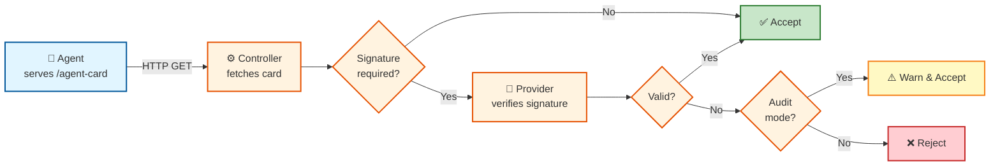
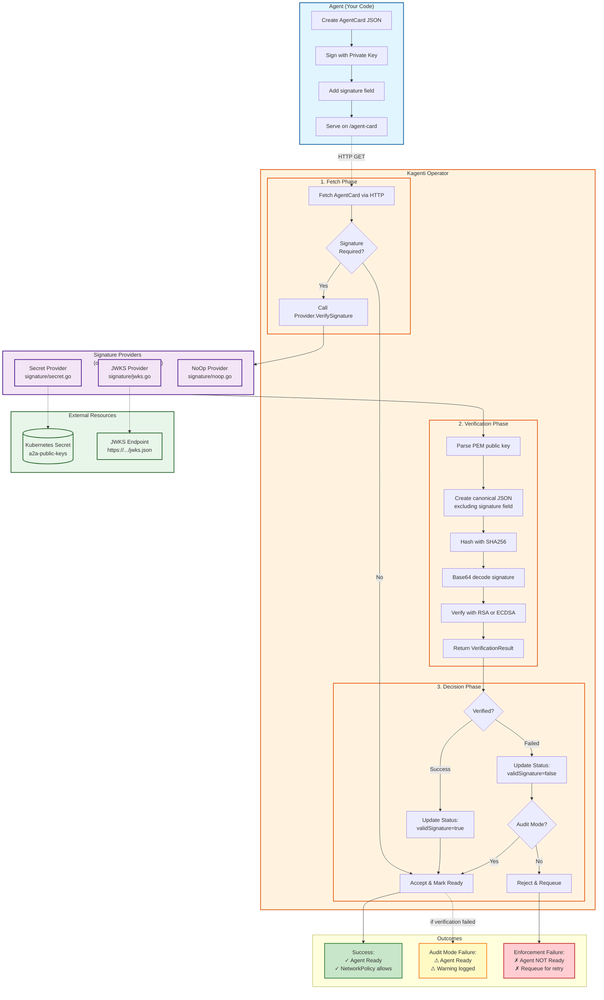

# A2A Signature Verification - Complete Setup Guide

**GitHub Issue**: [#116 - Feature: Strict CardSignature Checking](https://github.com/kagenti/kagenti-operator/issues/116)

This guide walks you through setting up A2A AgentCard signature verification from scratch. By the end, you'll have a working system where only agents with cryptographically signed AgentCards can communicate.

---

## What Is This?

**Kagenti Operator** is a Kubernetes operator that manages AI agents following the [A2A (Agent-to-Agent) Protocol](https://a2a-protocol.org/). Agents discover each other by publishing an **AgentCard** - a JSON document describing the agent's capabilities.

**Signature verification** ensures that:
- ✅ Only agents you trust can join your network
- ✅ AgentCards cannot be spoofed or tampered with  
- ✅ You have cryptographic proof of agent identity

**Without signature verification**: Any pod can claim to be any agent.

**With signature verification**: Only agents with cards signed by your private key are accepted.

---

## Table of Contents

1. [Prerequisites](#1-prerequisites)
2. [Architecture Overview](#2-architecture-overview)
3. [Quick Start (5 minutes)](#3-quick-start-5-minutes)
4. [Detailed Setup](#4-detailed-setup)
   - [Step 1: Create Kubernetes Cluster](#step-1-create-kubernetes-cluster)
   - [Step 2: Install Dependencies](#step-2-install-dependencies)
   - [Step 3: Generate Signing Keys](#step-3-generate-signing-keys)
   - [Step 4: Create Kubernetes Secret](#step-4-create-kubernetes-secret)
   - [Step 5: Install Kagenti Operator](#step-5-install-kagenti-operator)
   - [Step 6: Sign an AgentCard](#step-6-sign-an-agentcard)
   - [Step 7: Deploy a Signed Agent](#step-7-deploy-a-signed-agent)
   - [Step 8: Verify Signature Verification](#step-8-verify-signature-verification)
5. [Advanced Features](#5-advanced-features)
   - [JWKS Provider Setup](#jwks-provider-setup)
   - [NetworkPolicy Enforcement](#networkpolicy-enforcement)
   - [Audit Mode](#audit-mode)
6. [Troubleshooting](#6-troubleshooting)
7. [Reference](#7-reference)
8. [Cleanup](#8-cleanup)
9. [Key Rotation](#9-key-rotation)

---

## 1. Prerequisites

Before you begin, ensure you have:

| Tool | Minimum Version | Check Command |
|------|-----------------|---------------|
| `kubectl` | v1.28+ | `kubectl version --client` |
| `helm` | v3.0+ | `helm version` |
| `openssl` | any | `openssl version` |
| `python3` | 3.8+ | `python3 --version` |
| Docker or Podman | any | `docker version` |

**Python packages** (for signing):
```bash
pip3 install cryptography
```

**Kubernetes cluster** options:
- **Local**: `kind`, `minikube`, `k3d`, or Docker Desktop
- **Cloud**: Any Kubernetes cluster (EKS, GKE, AKS, OpenShift)

**Clone the repository:**
```bash
git clone https://github.com/kagenti/kagenti-operator.git
cd kagenti-operator
```

> All commands in this guide assume you're in the `kagenti-operator` directory.

---

## 2. Architecture Overview

**High-Level Flow:**


```mermaid
flowchart LR
    A["🤖 Agent<br/>serves /agent-card"]
    B["⚙️ Controller<br/>fetches card"]
    C{"Signature<br/>required?"}
    D["✅ Accept"]
    E["🔑 Provider<br/>verifies signature"]
    F{"Valid?"}
    G{"Audit<br/>mode?"}
    H["⚠️ Warn & Accept"]
    I["❌ Reject"]

    A -->|"HTTP GET"| B
    B --> C
    C -->|"No"| D
    C -->|"Yes"| E
    E --> F
    F -->|"Yes"| D
    F -->|"No"| G
    G -->|"Yes"| H
    G -->|"No"| I

    classDef agentClass fill:#e1f5ff,stroke:#01579b,stroke-width:2px
    classDef operatorClass fill:#fff3e0,stroke:#e65100,stroke-width:2px
    classDef successClass fill:#c8e6c9,stroke:#2e7d32,stroke-width:2px
    classDef warnClass fill:#fff9c4,stroke:#f57f17,stroke-width:2px
    classDef failClass fill:#ffcdd2,stroke:#c62828,stroke-width:2px

    class A agentClass
    class B,C,E,F,G operatorClass
    class D successClass
    class H warnClass
    class I failClass
```

**Architecture Diagram:**


```mermaid
flowchart TB
    subgraph Agent["Agent (Your Code)"]
        A1[Create AgentCard JSON]
        A2[Sign with Private Key]
        A3[Add signature field]
        A4[Serve on /agent-card]
        A1 --> A2 --> A3 --> A4
    end

    subgraph Operator["Kagenti Operator"]
        subgraph Fetch["1. Fetch Phase"]
            R1[Fetch AgentCard via HTTP]
            R2{Signature<br/>Required?}
            R3[Call Provider.VerifySignature]
        end

        subgraph Verify["2. Verification Phase"]
            V1[Parse PEM public key]
            V2[Create canonical JSON<br/>excluding signature field]
            V3[Hash with SHA256]
            V4[Base64 decode signature]
            V5[Verify with RSA or ECDSA]
            V6[Return VerificationResult]
        end

        subgraph Decide["3. Decision Phase"]
            R5{Verified?}
            R6[Update Status:<br/>validSignature=true]
            R7[Update Status:<br/>validSignature=false]
            R4{Audit Mode?}
            R8[Accept & Mark Ready]
            R9[Reject & Requeue]
        end
    end

    subgraph Providers["Signature Providers<br/>(one is configured at startup)"]
        P1[Secret Provider<br/>signature/secret.go]
        P2[JWKS Provider<br/>signature/jwks.go]
        P3[NoOp Provider<br/>signature/noop.go]
    end

    subgraph External["External Resources"]
        E1[(Kubernetes Secret<br/>a2a-public-keys)]
        E2[JWKS Endpoint<br/>https://.../jwks.json]
    end

    subgraph Results["Outcomes"]
        RES1[Success:<br/>✓ Agent Ready<br/>✓ NetworkPolicy allows]
        RES2[Audit Mode Failure:<br/>⚠ Agent Ready<br/>⚠ Warning logged]
        RES3[Enforcement Failure:<br/>✗ Agent NOT Ready<br/>✗ Requeue for retry]
    end

    %% Main flow - all arrows go downward
    A4 -.->|"HTTP GET"| R1
    R1 --> R2
    R2 -->|"No"| R8
    R2 -->|"Yes"| R3
    R3 --> Providers
    Providers --> V1
    V1 --> V2 --> V3 --> V4 --> V5 --> V6
    V6 --> R5
    R5 -->|"Success"| R6
    R5 -->|"Failed"| R7
    R6 --> R8
    R7 --> R4
    R4 -->|"Yes"| R8
    R4 -->|"No"| R9

    %% External resources (side connections)
    P1 -.-> E1
    P2 -.-> E2

    %% Final outcomes
    R8 --> RES1
    R8 -.->|"if verification failed"| RES2
    R9 --> RES3

    classDef agentClass fill:#e1f5ff,stroke:#01579b,stroke-width:2px
    classDef operatorClass fill:#fff3e0,stroke:#e65100,stroke-width:2px
    classDef providerClass fill:#f3e5f5,stroke:#4a148c,stroke-width:2px
    classDef externalClass fill:#e8f5e9,stroke:#1b5e20,stroke-width:2px
    classDef successClass fill:#c8e6c9,stroke:#2e7d32,stroke-width:2px
    classDef warningClass fill:#fff9c4,stroke:#f57f17,stroke-width:2px
    classDef failClass fill:#ffcdd2,stroke:#c62828,stroke-width:2px

    class Agent agentClass
    class Operator,Fetch,Verify,Decide operatorClass
    class Providers,P1,P2,P3 providerClass
    class External,E1,E2 externalClass
    class RES1 successClass
    class RES2 warningClass
    class RES3 failClass
```

**Component responsibilities:**

| Component | Responsibility | Code Location |
|-----------|---------------|---------------|
| **Agent** | Sign AgentCard, serve on HTTP endpoint | Your code |
| **AgentCardReconciler** | Fetch cards, orchestrate verification, update status | `internal/controller/agentcard_controller.go` |
| **Provider Interface** | Abstract signature verification | `internal/signature/provider.go` |
| **Secret Provider** | Fetch keys from Kubernetes Secrets, call VerifyWithPublicKey | `internal/signature/secret.go` |
| **JWKS Provider** | Fetch keys from HTTP JWKS endpoints, call VerifyWithPublicKey | `internal/signature/jwks.go` |
| **VerifyWithPublicKey** | Core crypto: canonical JSON, SHA256 hash, RSA/ECDSA verify | `internal/signature/verifier.go` |
| **NetworkPolicy Controller** | Create/update NetworkPolicies based on verification | `internal/controller/agentcard_networkpolicy_controller.go` |
| **Metrics** | Prometheus counters/histograms for verification | `internal/signature/metrics.go` |


---

## 3. Quick Start (5 minutes)

For those who want to get started immediately:

```bash
# 0. Clone the repository
git clone https://github.com/kagenti/kagenti-operator.git
cd kagenti-operator

# 1. Create cluster (skip if you have one)
kind create cluster --name kagenti-demo

# 2. Install cert-manager
kubectl apply -f https://github.com/cert-manager/cert-manager/releases/download/v1.16.2/cert-manager.yaml
kubectl wait --for=condition=Available deployment/cert-manager -n cert-manager --timeout=120s

# 3. Generate keys
openssl genrsa -out private-key.pem 2048
openssl rsa -in private-key.pem -pubout -out public-key.pem

# 4. Create namespace and secret
kubectl create namespace kagenti-system
kubectl label namespace kagenti-system control-plane=kagenti-operator
kubectl create secret generic a2a-public-keys \
  --from-file=public.pem=public-key.pem \
  --from-file=my-signing-key=public-key.pem \
  --namespace=kagenti-system

# 5. Install operator
# For released versions:
helm install kagenti-operator ./charts/kagenti-operator \
  --namespace kagenti-system \
  --set signatureVerification.enabled=true \
  --set signatureVerification.provider=secret

# For local development (build and load image first):
# cd kagenti-operator && make docker-build IMG=kagenti-operator:dev
# kind load docker-image kagenti-operator:dev --name kagenti-demo
# helm install kagenti-operator ./charts/kagenti-operator \
#   --namespace kagenti-system \
#   --set signatureVerification.enabled=true \
#   --set signatureVerification.provider=secret \
#   --set controllerManager.container.image.repository=kagenti-operator \
#   --set controllerManager.container.image.tag=dev \
#   --set controllerManager.container.cmd=/manager

# 6. Verify installation
kubectl wait --for=condition=Available deployment/kagenti-controller-manager \
  -n kagenti-system --timeout=120s
kubectl logs -n kagenti-system deployment/kagenti-controller-manager | grep signature
# Should show: "A2A signature verification enabled"
```

Now continue to [Step 6](#step-6-sign-an-agentcard) to sign and deploy your first agent.

---

## 4. Detailed Setup

### Step 1: Create Kubernetes Cluster

**Option A: Local with kind**
```bash
kind create cluster --name kagenti-demo
```

**Option B: Local with minikube**
```bash
minikube start --driver=docker
```

**Verify cluster:**
```bash
kubectl cluster-info
kubectl get nodes
```

---

### Step 2: Install Dependencies

**Install cert-manager** (required for webhook certificates):

```bash
kubectl apply -f https://github.com/cert-manager/cert-manager/releases/download/v1.16.2/cert-manager.yaml
```

**Wait for cert-manager to be ready:**
```bash
kubectl wait --for=condition=Available deployment/cert-manager -n cert-manager --timeout=120s
kubectl wait --for=condition=Available deployment/cert-manager-webhook -n cert-manager --timeout=120s
kubectl wait --for=condition=Available deployment/cert-manager-cainjector -n cert-manager --timeout=120s
```

---

### Step 3: Generate Signing Keys

**Generate a 2048-bit RSA key pair:**

```bash
# Generate private key (keep this secret!)
openssl genrsa -out private-key.pem 2048

# Extract public key (this goes into Kubernetes)
openssl rsa -in private-key.pem -pubout -out public-key.pem
```

**Verify keys were created:**
```bash
ls -la *.pem
# Should show:
# -rw-------  private-key.pem  (about 1.7KB)
# -rw-r--r--  public-key.pem   (about 450 bytes)
```

> ⚠️ **Security**: Keep `private-key.pem` secure! Never commit it to git or share it.

---

### Step 4: Create Kubernetes Secret

**Create the namespace:**
```bash
kubectl create namespace kagenti-system
kubectl label namespace kagenti-system control-plane=kagenti-operator
```

**Create the secret with your public key:**
```bash
kubectl create secret generic a2a-public-keys \
  --from-file=public.pem=public-key.pem \
  --from-file=my-signing-key=public-key.pem \
  --namespace=kagenti-system
```

**Verify the secret:**
```bash
kubectl get secret a2a-public-keys -n kagenti-system -o yaml
```

---

### Step 5: Install Kagenti Operator

**Install with signature verification enabled:**

```bash
helm install kagenti-operator ./charts/kagenti-operator \
  --namespace kagenti-system \
  --set signatureVerification.enabled=true \
  --set signatureVerification.provider=secret \
  --set signatureVerification.secretName=a2a-public-keys \
  --set signatureVerification.secretNamespace=kagenti-system
```

**Wait for operator to be ready:**
```bash
kubectl wait --for=condition=Available deployment/kagenti-controller-manager \
  -n kagenti-system --timeout=120s
```

**Verify signature verification is enabled:**
```bash
kubectl logs -n kagenti-system deployment/kagenti-controller-manager | grep -i signature
# Expected output: "A2A signature verification enabled" with "provider":"secret"
```

---

### Step 6: Sign an AgentCard

**Create a Python signing script** (`sign-card.py`):

```python
#!/usr/bin/env python3
"""Sign an A2A AgentCard with RSA private key."""

import json
import base64
import sys
from datetime import datetime, timezone
from cryptography.hazmat.primitives import hashes, serialization
from cryptography.hazmat.primitives.asymmetric import padding
from cryptography.hazmat.backends import default_backend

def sign_agent_card(card_path: str, private_key_path: str, key_id: str) -> dict:
    """Sign an AgentCard and return the signed version."""
    
    # Load the card
    with open(card_path, 'r') as f:
        card = json.load(f)
    
    # Remove any existing signature
    card_without_sig = {k: v for k, v in card.items() if k != 'signature'}
    
    # Create canonical JSON (sorted keys, no whitespace)
    canonical = json.dumps(card_without_sig, sort_keys=True, separators=(',', ':'))
    
    # Load private key
    with open(private_key_path, 'rb') as f:
        private_key = serialization.load_pem_private_key(
            f.read(), password=None, backend=default_backend()
        )
    
    # Sign
    signature_bytes = private_key.sign(
        canonical.encode('utf-8'),
        padding.PKCS1v15(),
        hashes.SHA256()
    )
    
    # Add signature to card
    card['signature'] = {
        'algorithm': 'RS256',
        'keyId': key_id,
        'value': base64.b64encode(signature_bytes).decode('utf-8'),
        'timestamp': datetime.now(timezone.utc).isoformat().replace('+00:00', 'Z')
    }
    
    return card

if __name__ == '__main__':
    if len(sys.argv) != 4:
        print(f"Usage: {sys.argv[0]} <card.json> <private-key.pem> <key-id>")
        sys.exit(1)
    
    signed = sign_agent_card(sys.argv[1], sys.argv[2], sys.argv[3])
    print(json.dumps(signed, indent=2))
```

**Create an unsigned AgentCard** (`my-agent-card.json`):

```json
{
  "name": "Weather Agent",
  "description": "Provides weather information for any location",
  "version": "1.0.0",
  "url": "http://weather-agent-svc.default.svc.cluster.local:8000",
  "capabilities": {
    "streaming": true,
    "pushNotifications": false
  },
  "defaultInputModes": ["text/plain"],
  "defaultOutputModes": ["application/json"]
}
```

**Sign the AgentCard:**

```bash
python3 sign-card.py my-agent-card.json private-key.pem my-signing-key > signed-agent-card.json
```

**Verify the signed card:**
```bash
cat signed-agent-card.json
```

**Expected output:**
```json
{
  "name": "Weather Agent",
  "description": "Provides weather information for any location",
  "version": "1.0.0",
  "url": "http://weather-agent-svc.default.svc.cluster.local:8000",
  "capabilities": {
    "streaming": true,
    "pushNotifications": false
  },
  "defaultInputModes": ["text/plain"],
  "defaultOutputModes": ["application/json"],
  "signature": {
    "algorithm": "RS256",
    "keyId": "my-signing-key",
    "value": "base64-encoded-signature...",
    "timestamp": "2025-12-02T10:00:00Z"
  }
}
```

---

### Step 7: Deploy a Signed Agent

**Create the ConfigMap with your signed card:**

```bash
# This creates the ConfigMap YAML with your signed card properly indented
cat > weather-agent-configmap.yaml << EOF
apiVersion: v1
kind: ConfigMap
metadata:
  name: weather-agent-card
  namespace: default
data:
  agent.json: |
$(cat signed-agent-card.json | sed 's/^/    /')
EOF
```

**Create the Agent and AgentCard resources** (`weather-agent.yaml`):

```yaml
---
# Agent resource (creates Deployment + Service)
apiVersion: agent.kagenti.dev/v1alpha1
kind: Agent
metadata:
  name: weather-agent
  namespace: default
  labels:
    app.kubernetes.io/name: weather-agent
    kagenti.io/type: agent
    kagenti.io/agent-protocol: a2a
spec:
  description: "Provides weather information for any location"
  replicas: 1

  imageSource:
    image: "python:3.11-slim"

  servicePorts:
    - name: http
      port: 8000
      protocol: TCP
      targetPort: 8000

  podTemplateSpec:
    spec:
      initContainers:
      - name: setup-agentcard
        image: python:3.11-slim
        command: ["sh", "-c", "mkdir -p /app/.well-known && cp /data/agent.json /app/.well-known/agent.json"]
        volumeMounts:
        - name: card
          mountPath: /data
          readOnly: true
        - name: app-dir
          mountPath: /app
      containers:
      - name: agent
        command: ["python3", "-m", "http.server", "8000"]
        workingDir: /app
        volumeMounts:
        - name: app-dir
          mountPath: /app
      volumes:
      - name: card
        configMap:
          name: weather-agent-card
      - name: app-dir
        emptyDir: {}

---
# AgentCard resource (triggers signature verification)
apiVersion: agent.kagenti.dev/v1alpha1
kind: AgentCard
metadata:
  name: weather-agent-card
  namespace: default
spec:
  syncPeriod: "30s"
  selector:
    matchLabels:
      app.kubernetes.io/name: weather-agent
      kagenti.io/type: agent
```

**Deploy both files:**

```bash
# Apply the ConfigMap (contains your signed AgentCard)
kubectl apply -f weather-agent-configmap.yaml

# Apply the Agent and AgentCard resources
kubectl apply -f weather-agent.yaml
```

---

### Step 8: Verify Signature Verification

**Check the AgentCard status:**

```bash
kubectl get agentcard weather-agent-card -o yaml
```

**Look for these fields in the status:**
```yaml
status:
  validSignature: true
  signatureVerificationDetails: "Signature verified successfully"
  signatureKeyID: "my-signing-key"
  conditions:
    - type: SignatureVerified
      status: "True"
      reason: SignatureValid
```

**Check operator logs for verification details:**

```bash
kubectl logs -n kagenti-system deployment/kagenti-controller-manager | grep -i verif
```

🎉 **Congratulations!** You have successfully set up A2A signature verification!

---

## 5. Advanced Features

### JWKS Provider Setup

Instead of storing keys in Kubernetes Secrets, you can use a JWKS endpoint:

```bash
helm upgrade kagenti-operator ./charts/kagenti-operator \
  --namespace kagenti-system \
  --set signatureVerification.enabled=true \
  --set signatureVerification.provider=jwks \
  --set signatureVerification.jwksURL=https://your-domain.com/.well-known/jwks.json
```

---

### NetworkPolicy Enforcement

Enable network-level blocking of unverified agents:

```bash
helm upgrade kagenti-operator ./charts/kagenti-operator \
  --namespace kagenti-system \
  --set signatureVerification.enabled=true \
  --set signatureVerification.networkPolicyEnabled=true
```

This creates NetworkPolicies that only allow traffic from agents with `validSignature: true`.

---

### Audit Mode

Test signature verification without blocking agents:

```bash
helm upgrade kagenti-operator ./charts/kagenti-operator \
  --namespace kagenti-system \
  --set signatureVerification.enabled=true \
  --set signatureVerification.auditMode=true
```

In audit mode:
- ✅ Agents with invalid signatures are still accepted
- ⚠️ Warnings are logged
- 📊 Metrics still track failures
- 📋 Status shows `validSignature: false`

---

## 6. Troubleshooting

### Issue: "no signature provided"

**Cause:** AgentCard doesn't have a signature field.

**Solution:** Sign your AgentCard using the Python script in Step 6.

---

### Issue: "key not found in secret"

**Cause:** The `keyId` in the signature doesn't match any key in the secret.

**Solution:** Ensure the secret contains a key with the same name as `keyId`:
```bash
kubectl get secret a2a-public-keys -n kagenti-system -o jsonpath='{.data}' | jq
```

---

### Issue: "signature verification failed"

**Cause:** The signature doesn't match the card content.

**Solutions:**
1. Ensure you're using the correct private key
2. Ensure the card content hasn't changed after signing
3. Check that the canonical JSON matches (sorted keys, no whitespace)

---

### Issue: "failed to fetch secret"

**Cause:** Operator can't access the secret.

**Solution:** Check RBAC permissions and secret namespace:
```bash
kubectl auth can-i get secrets -n kagenti-system --as=system:serviceaccount:kagenti-system:kagenti-controller-manager
```

---

### Issue: AgentCard stuck in "Pending"

**Cause:** Agent pod isn't serving the card yet.

**Solution:** Check agent pod status and logs:
```bash
kubectl get pods -l app.kubernetes.io/name=weather-agent
kubectl logs -l app.kubernetes.io/name=weather-agent
```

---

## 7. Reference

### Helm Values

| Parameter | Description | Default |
|-----------|-------------|---------|
| `signatureVerification.enabled` | Enable signature verification | `false` |
| `signatureVerification.provider` | Provider type: `secret`, `jwks`, or `none` | `secret` |
| `signatureVerification.secret.name` | Name of the K8s secret with public keys | `a2a-public-keys` |
| `signatureVerification.secret.namespace` | Namespace of the secret | `kagenti-system` |
| `signatureVerification.secret.key` | Specific key in secret to use (auto-detect if empty) | `""` |
| `signatureVerification.jwks.url` | JWKS endpoint URL (for jwks provider) | `""` |
| `signatureVerification.auditMode` | Log failures without blocking | `false` |
| `signatureVerification.enforceNetworkPolicies` | Create NetworkPolicies for network-level enforcement | `false` |

### CLI Flags

| Flag | Description |
|------|-------------|
| `--require-a2a-signature` | Enable signature verification |
| `--signature-provider` | Provider type: `secret`, `jwks`, `none` |
| `--signature-secret-name` | Secret name for public keys |
| `--signature-secret-namespace` | Secret namespace |
| `--signature-jwks-url` | JWKS endpoint URL |
| `--signature-audit-mode` | Enable audit mode |

### Prometheus Metrics

| Metric | Type | Description |
|--------|------|-------------|
| `a2a_signature_verification_total` | Counter | Total verification attempts (labels: provider, result, audit_mode) |
| `a2a_signature_verification_errors_total` | Counter | Verification errors (labels: provider, error_type) |
| `a2a_signature_verification_duration_seconds` | Histogram | Verification duration (labels: provider) |

---

## 8. Cleanup

To remove everything created in this guide:

```bash
# Delete the test agent
kubectl delete agentcard weather-agent-card -n default
kubectl delete agent weather-agent -n default
kubectl delete configmap weather-agent-card -n default

# Uninstall the operator
helm uninstall kagenti-operator -n kagenti-system

# Delete the secret and namespace
kubectl delete secret a2a-public-keys -n kagenti-system
kubectl delete namespace kagenti-system

# Delete the kind cluster (if you created one)
kind delete cluster --name kagenti-demo

# Clean up local files
rm -f private-key.pem public-key.pem signed-agent-card.json my-agent-card.json
```

---

## 9. Key Rotation

To rotate signing keys without downtime:

**Step 1: Generate new key pair**
```bash
openssl genrsa -out new-private-key.pem 2048
openssl rsa -in new-private-key.pem -pubout -out new-public-key.pem
```

**Step 2: Add new public key to secret (keep old key)**
```bash
kubectl create secret generic a2a-public-keys \
  --from-file=old-key=public-key.pem \
  --from-file=new-key=new-public-key.pem \
  --namespace=kagenti-system \
  --dry-run=client -o yaml | kubectl apply -f -
```

**Step 3: Restart operator to load new keys**
```bash
kubectl rollout restart deployment/kagenti-controller-manager -n kagenti-system
```

**Step 4: Update agents to use new key**
```bash
# Re-sign your AgentCards with the new key
python3 sign-card.py my-agent-card.json new-private-key.pem new-key > signed-agent-card.json
# Update ConfigMaps and restart agents
```

**Step 5: Remove old key after all agents migrated**
```bash
kubectl create secret generic a2a-public-keys \
  --from-file=new-key=new-public-key.pem \
  --namespace=kagenti-system \
  --dry-run=client -o yaml | kubectl apply -f -
kubectl rollout restart deployment/kagenti-controller-manager -n kagenti-system
```

---

## Summary

You've now learned how to:

✅ **Set up** a Kubernetes cluster with cert-manager  
✅ **Generate** RSA key pairs for signing  
✅ **Configure** Kagenti Operator with signature verification  
✅ **Sign** AgentCards using Python  
✅ **Deploy** agents with verified signatures  
✅ **Use advanced features**: JWKS, NetworkPolicies, Audit mode  
✅ **Troubleshoot** common issues  
✅ **Rotate** signing keys  

**What you've built:**
- A secure agent platform where only cryptographically signed agents can communicate
- Defense-in-depth with optional NetworkPolicy enforcement
- Observability with Prometheus metrics
- Flexible key management with Secret or JWKS providers

For production deployments, consider:
- Using 4096-bit RSA keys or ECDSA
- Storing private keys in a vault (HashiCorp Vault, AWS KMS, etc.)
- Enabling NetworkPolicy enforcement
- Setting up Prometheus alerts on verification failures
- Implementing automated key rotation

