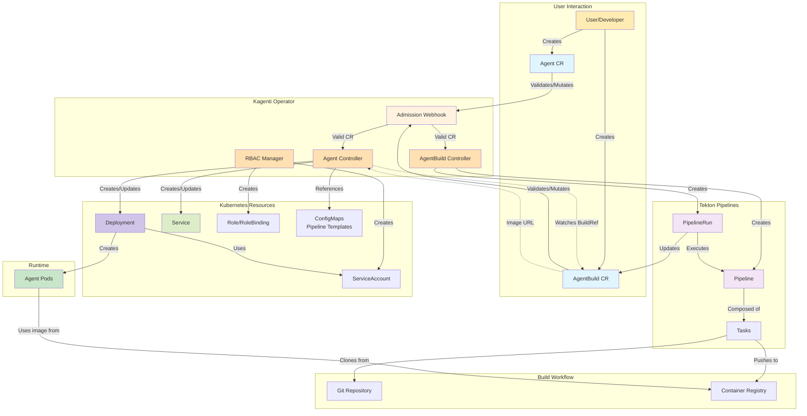
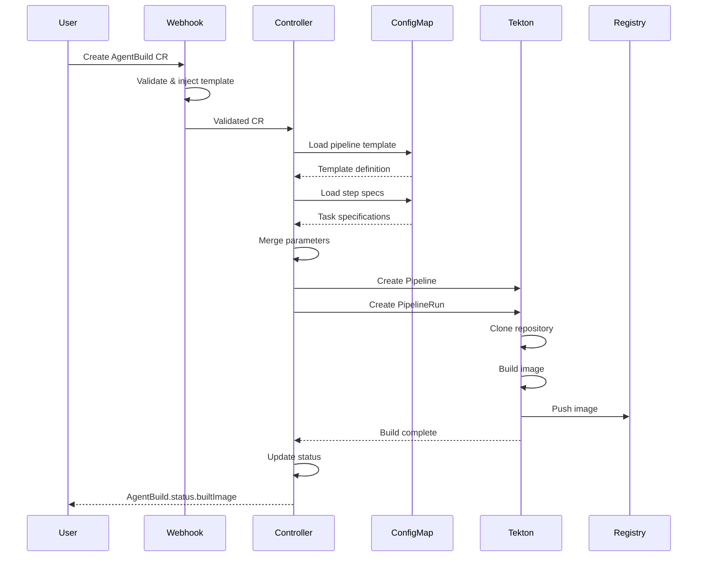

# Architecture

This document provides a detailed overview of the Kagenti Operator architecture, including its components, workflows, and design principles.

## Table of Contents

- [Overview](#overview)
- [Core Components](#core-components)
- [Architecture Diagram](#architecture-diagram)
- [Controller Architecture](#controller-architecture)
- [Build System Architecture](#build-system-architecture)
- [Reconciliation Loops](#reconciliation-loops)
- [Security Model](#security-model)
- [Deployment Modes](#deployment-modes)

---

## Overview

The Kagenti Operator is a Kubernetes controller that implements the [Operator Pattern](https://kubernetes.io/docs/concepts/extend-kubernetes/operator/) to automate the complete lifecycle of AI agents. It separates concerns between building container images (AgentBuild) and deploying workloads (Agent), providing flexibility and maintainability.

### Design Goals

- **Separation of Concerns**: Build and deployment are independent
- **Declarative Configuration**: Infrastructure as Code using Kubernetes CRDs
- **Extensibility**: Template-based build system supporting custom pipelines
- **Security**: Built-in RBAC, secret management, and least-privilege principles
- **Scalability**: Supports multiple agents and builds concurrently
- **Cloud-Native**: Leverages native Kubernetes primitives and patterns

---

## Core Components

### Custom Resource Definitions (CRDs)

#### Agent CRD
- Defines desired state of an AI agent deployment
- Manages Kubernetes Deployment and Service resources
- Supports both pre-built images and build references
- Provides status feedback on deployment health

#### AgentBuild CRD
- Defines build specifications for container images
- Orchestrates Tekton pipelines for building from source
- Stores build status and output image URLs
- Supports multiple build modes (dev, prod, custom)

### Controllers

#### Agent Controller
- Watches Agent resources
- Creates and manages Deployments and Services
- Resolves image sources (direct or from AgentBuild)
- Updates status conditions based on deployment state
- Handles resource cleanup on deletion

#### AgentBuild Controller
- Watches AgentBuild resources
- Creates Tekton Pipelines and PipelineRuns
- Manages pipeline templates and parameters
- Updates build status and stores output images
- Handles cleanup after build completion

### Supporting Components

#### Webhook
- Validates Agent and AgentBuild resources
- Mutates resources with default values
- Injects pipeline templates based on mode
- Prevents invalid configurations

#### RBAC Manager
- Creates ServiceAccounts for agents
- Manages Roles and RoleBindings
- Implements least-privilege access control

---

## Architecture Diagram



---

## Controller Architecture

### Agent Controller

The Agent Controller implements a reconciliation loop that ensures the desired state (Agent CR) matches the actual state (Kubernetes resources).

#### Reconciliation Flow

```
1. Watch for Agent CR changes
2. Validate CR exists and not being deleted
3. Add finalizer for cleanup handling
4. Resolve image source:
   a. If image specified → use directly
   b. If buildRef specified → fetch from AgentBuild status
   c. Wait if build not complete
5. Create/Update Deployment:
   a. Generate deployment spec from podTemplateSpec
   b. Set owner references
   c. Apply to cluster
6. Create/Update Service:
   a. Generate service spec from servicePorts
   b. Set owner references
   c. Apply to cluster
7. Update Agent status:
   a. Set deployment phase
   b. Update conditions
   c. Record ready replicas
8. Requeue if not ready, otherwise complete
```

#### Status Conditions

The controller maintains several conditions:

| Condition | Meaning |
|-----------|---------|
| `DeploymentAvailable` | Deployment resource exists |
| `PodsScheduled` | Pods are scheduled on nodes |
| `Ready` | All replicas are ready and serving |

#### Image Resolution

```go
func (r *AgentReconciler) getContainerImage(ctx context.Context, agent *Agent) (string, error) {
    if agent.Spec.ImageSource.Image != nil {
        return *agent.Spec.ImageSource.Image, nil
    }
    
    if agent.Spec.ImageSource.BuildRef != nil {
        return r.fetchImageFromAgentBuild(ctx, agent, agent.Spec.ImageSource.BuildRef.Name)
    }
    
    return "", fmt.Errorf("no image source specified")
}
```

### AgentBuild Controller

The AgentBuild Controller orchestrates the build process using Tekton pipelines.

#### Reconciliation Flow

```
1. Watch for AgentBuild CR changes
2. Validate CR and add finalizer
3. Load pipeline template based on mode
4. Merge user parameters with template defaults
5. Create Tekton Pipeline resource:
   a. Load task specs from ConfigMaps
   b. Compose pipeline from steps
   c. Apply parameter overrides
6. Create PipelineRun:
   a. Set source parameters (repo, revision)
   b. Set build parameters (image, registry)
   c. Reference secrets for credentials
7. Watch PipelineRun status:
   a. Update AgentBuild phase
   b. Store build messages
   c. Capture output image URL
8. On success:
   a. Store builtImage in status
   b. Set phase to Succeeded
   c. Trigger cleanup if enabled
9. On failure:
   a. Set phase to Failed
   b. Record error message
```

#### Pipeline Lifecycle

```
Pending → Building → [Succeeded | Failed]
   ↓         ↓            ↓
Create   Execute      Store Image
Pipeline PipelineRun     URL
```

---

## Build System Architecture

The build system uses a template-based approach that provides both simplicity and flexibility.

### Pipeline Template System

#### Template Structure

```
ConfigMap (pipeline-template-<mode>)
├── metadata
│   ├── name: template name
│   ├── namespace: template location
│   └── description: template purpose
├── steps[]
│   ├── name: step identifier
│   ├── configMap: step definition reference
│   ├── enabled: default enable state
│   ├── defaultParameters[]: default values
│   └── requiredParameters[]: must be provided
└── globalParameters[]: applies to all steps
```

#### Step Storage

Each step is stored in a separate ConfigMap:

```
ConfigMap (step-<name>)
└── task-spec.yaml: Complete Tekton TaskSpec
    ├── params: step parameters
    ├── workspaces: required workspaces
    └── steps: container commands
```

### Build Modes

| Mode | Description | Use Case |
|------|-------------|----------|
| `dev` | Basic build with Dockerfile | Development with internal registry |
| `buildpack-dev` | Cloud Native Buildpacks | Development without Dockerfile |
| `dev-external` | Basic build, external registry | Development with external registry |
| `preprod` | Adds security scanning | Pre-production validation |
| `prod` | Full compliance checks | Production deployments |
| `custom` | User-defined steps | Advanced customization |

### Parameter Resolution

Parameters are resolved in this order (highest to lowest priority):

1. User-provided parameters in AgentBuild CR
2. Step-specific parameters
3. Global template parameters
4. Step default parameters

```yaml
# User provides minimal config
parameters:
  - name: SOURCE_REPO_URL
    value: "github.com/myorg/myapp"

# System merges with defaults
# Final pipeline gets:
#   SOURCE_REPO_URL: "github.com/myorg/myapp" (user)
#   SOURCE_REVISION: "main" (template default)
#   BUILD_CONTEXT: "." (step default)
```

### Build Execution Flow



---

## Reconciliation Loops

### Agent Reconciliation

```go
func (r *AgentReconciler) Reconcile(ctx context.Context, req Request) (Result, error) {
    // 1. Fetch Agent
    agent := &Agent{}
    if err := r.Get(ctx, req.NamespacedName, agent); err != nil {
        return Result{}, client.IgnoreNotFound(err)
    }

    // 2. Handle deletion
    if !agent.DeletionTimestamp.IsZero() {
        return r.handleDeletion(ctx, agent)
    }

    // 3. Add finalizer
    if !controllerutil.ContainsFinalizer(agent, FINALIZER) {
        controllerutil.AddFinalizer(agent, FINALIZER)
        return Result{}, r.Update(ctx, agent)
    }

    // 4. Resolve image
    image, err := r.getContainerImage(ctx, agent)
    if err != nil {
        return Result{RequeueAfter: 10*time.Second}, nil
    }

    // 5. Reconcile Deployment
    if result, err := r.reconcileDeployment(ctx, agent, image); err != nil {
        return result, err
    }

    // 6. Reconcile Service
    if result, err := r.reconcileService(ctx, agent); err != nil {
        return result, err
    }

    return Result{}, nil
}
```

### AgentBuild Reconciliation

```go
func (r *AgentBuildReconciler) Reconcile(ctx context.Context, req Request) (Result, error) {
    // 1. Fetch AgentBuild
    build := &AgentBuild{}
    if err := r.Get(ctx, req.NamespacedName, build); err != nil {
        return Result{}, client.IgnoreNotFound(err)
    }

    // 2. Check if already complete
    if build.Status.Phase == PhaseSucceeded || build.Status.Phase == PhaseFailed {
        return Result{}, nil
    }

    // 3. Load pipeline template
    template, err := r.loadTemplate(ctx, build.Spec.Mode)
    if err != nil {
        return Result{}, err
    }

    // 4. Create Pipeline
    pipeline, err := r.createPipeline(ctx, build, template)
    if err != nil {
        return Result{}, err
    }

    // 5. Create PipelineRun
    pipelineRun, err := r.createPipelineRun(ctx, build, pipeline)
    if err != nil {
        return Result{}, err
    }

    // 6. Watch PipelineRun status
    if err := r.updateBuildStatus(ctx, build, pipelineRun); err != nil {
        return Result{}, err
    }

    return Result{RequeueAfter: 30*time.Second}, nil
}
```

---

## Security Model

### RBAC

The operator implements least-privilege access control:

#### Operator Permissions
- Read/Write: Agent, AgentBuild CRs
- Read/Write: Deployments, Services, ServiceAccounts
- Read/Write: Roles, RoleBindings
- Read: ConfigMaps, Secrets
- Create: Events

#### Agent Permissions (per ServiceAccount)
- Minimal runtime permissions
- Read access to required ConfigMaps
- Read access to required Secrets
- No cluster-wide permissions

### Secret Management

Secrets are referenced, never embedded:

```yaml
# Source credentials
sourceCredentials:
  name: github-token-secret  # Reference only

# Registry credentials
imageRepoCredentials:
  name: ghcr-secret  # Reference only
```

### Network Policies

The operator supports network isolation:

- Agents can be isolated in namespaces
- Network policies control inter-agent communication
- Service mesh integration for mTLS

---

## Deployment Modes

### Cluster-Wide Mode

- Operator watches all namespaces
- Uses ClusterRole and ClusterRoleBinding
- Suitable for platform teams
- Single operator instance manages entire cluster

```yaml
apiVersion: rbac.authorization.k8s.io/v1
kind: ClusterRole
metadata:
  name: kagenti-operator-manager-role
rules:
  - apiGroups: ["agent.kagenti.dev"]
    resources: ["agents", "agentbuilds"]
    verbs: ["*"]
```

### Namespaced Mode

- Operator watches specific namespaces
- Uses Role and RoleBinding per namespace
- Suitable for multi-tenant environments
- Multiple operator instances possible

```yaml
apiVersion: rbac.authorization.k8s.io/v1
kind: Role
metadata:
  name: kagenti-operator-manager-role
  namespace: team1
rules:
  - apiGroups: ["agent.kagenti.dev"]
    resources: ["agents", "agentbuilds"]
    verbs: ["*"]
```

---

## Performance and Scalability

### Resource Management

- Controllers use efficient caching (controller-runtime)
- Watches use Kubernetes informers
- Reconciliation includes backoff for transient errors
- Status updates use optimistic locking

### Scaling Considerations

| Component | Scaling Strategy |
|-----------|------------------|
| Operator | Single replica (leader election optional) |
| Agents | Horizontal scaling via replicas field |
| Builds | Concurrent builds supported |
| Tekton | Scales independently |

### Monitoring

The operator exposes metrics via Prometheus:

- Reconciliation duration
- Error rates
- Resource counts
- Build success/failure rates

---

## Extension Points

### Custom Build Steps

Add custom Tekton tasks:

```yaml
apiVersion: v1
kind: ConfigMap
metadata:
  name: custom-security-scan
  namespace: kagenti-system
data:
  task-spec.yaml: |
    apiVersion: tekton.dev/v1
    kind: TaskSpec
    params:
      - name: image
    steps:
      - name: scan
        image: security-scanner:latest
        script: |
          scan-image $(params.image)
```

### Custom Pipeline Templates

Create new build modes:

```yaml
apiVersion: v1
kind: ConfigMap
metadata:
  name: pipeline-template-enterprise
  namespace: kagenti-system
data:
  template.yaml: |
    name: enterprise
    steps:
      - name: security-scan
        configMap: custom-security-scan
      - name: compliance-check
        configMap: compliance-check-task
```

---

## Additional Resources

- [API Reference](./api-reference.md) — CRD specifications
- [Developer Guide](./dev.md) — Contributing to the operator
- [Getting Started](../GETTING_STARTED.md) — Tutorials and examples
