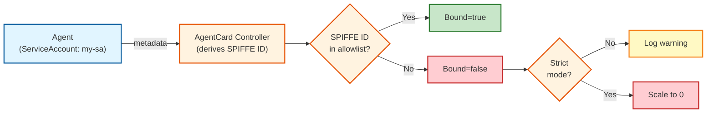
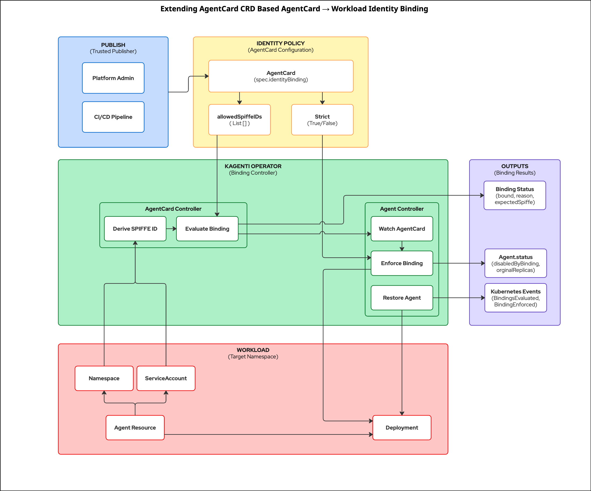

# AgentCard → Workload Identity Binding Setup Guide

**RFC (full design details):** [AgentCard → Workload Identity Binding (Step 1)](https://docs.google.com/document/d/1sOpE9tcw-DlG4Gi31t8e_CV15lNwpZ-NyA2OCDeZZEU/edit?usp=sharing)


This guide walks you through setting up AgentCard workload identity binding. By the end, you'll have a working system where AgentCards are **declaratively bound to workload identities** derived from Kubernetes metadata.

> **Note:** This implements Step 1 (policy-based binding using metadata-derived SPIFFE IDs). Runtime cryptographic enforcement via Service Mesh / Agent Gateway is planned for Step 2.

---

## Table of Contents

1. [Overview](#1-overview)
2. [Prerequisites](#2-prerequisites)
3. [Architecture](#3-architecture)
4. [Setup](#4-setup)
5. [Demo Scenarios](#5-demo-scenarios)
6. [Troubleshooting](#6-troubleshooting)
7. [Reference](#7-reference)
8. [Cleanup](#8-cleanup)

---

## 1. Overview

**Kagenti Operator** is a Kubernetes operator that manages AI agents following the [A2A Protocol](https://a2a-protocol.org/). Agents discover each other by publishing an **AgentCard** (a JSON document describing the agent's capabilities).

### What Identity Binding Provides

| Without Identity Binding | With Identity Binding |
|--------------------------|----------------------|
| Any workload can claim any AgentCard | Only workloads with matching SPIFFE IDs can serve specific AgentCards |

### Key Features

- **Declarative binding**: AgentCards bound to specific Kubernetes service accounts
- **SPIFFE-based identity**: Derived from namespace + service account
- **Strict enforcement**: Optionally disable agents that fail verification
- **Operational visibility**: Kubernetes Events for monitoring

---

## 2. Prerequisites

| Tool | Version | Verify |
|------|---------|--------|
| kubectl | v1.28+ | `kubectl version --client` |
| helm | v3.0+ | `helm version` |
| jq | any | `jq --version` |
| Docker/Podman | any | `docker version` |

**Kubernetes cluster options:**
- **Local:** kind, minikube, k3d, or Docker Desktop
- **Cloud:** EKS, GKE, AKS, OpenShift

**Clone the repository:**

```bash
git clone https://github.com/kagenti/kagenti-operator.git
cd kagenti-operator
```

> All commands assume you're in the `kagenti-operator` directory.

---

## 3. Architecture

### High-Level Flow



### SPIFFE ID Format

```
spiffe://<trust-domain>/ns/<namespace>/sa/<serviceAccount>
```

The operator derives this from Kubernetes metadata:
- **Trust Domain:** `identityBinding.trustDomain` or operator default (`cluster.local`)
- **Namespace:** `Agent.metadata.namespace`
- **ServiceAccount:** `podTemplateSpec.spec.serviceAccountName` (or `<agent-name>-sa` if not set)

**Example:**
```
spiffe://cluster.local/ns/production/sa/weather-agent-sa
```

### Detailed Architecture



---

## 4. Setup

### Step 1: Install Dependencies

```bash
# Create cluster (skip if you have one)
kind create cluster --name kagenti-demo

# Install cert-manager (for webhook certificates)
kubectl apply -f https://github.com/cert-manager/cert-manager/releases/download/v1.16.2/cert-manager.yaml
kubectl wait --for=condition=Available deployment/cert-manager -n cert-manager --timeout=120s

# Install Tekton (required for AgentBuild controller)
kubectl apply -f https://storage.googleapis.com/tekton-releases/pipeline/latest/release.yaml
sleep 30
```

### Step 2: Install Kagenti Operator

```bash
cd kagenti-operator
make docker-build IMG=kagenti-operator:dev
kind load docker-image kagenti-operator:dev --name kagenti-demo

kubectl create namespace kagenti-system
helm install kagenti-operator ../charts/kagenti-operator \
  --namespace kagenti-system \
  --set controllerManager.container.image.repository=kagenti-operator \
  --set controllerManager.container.image.tag=dev \
  --set controllerManager.container.cmd=/manager

# Verify
kubectl wait --for=condition=Available deployment/kagenti-controller-manager \
  -n kagenti-system --timeout=120s
kubectl logs -n kagenti-system deployment/kagenti-controller-manager | head -20
```

> **Note:** `--set controllerManager.container.cmd=/manager` is required for locally-built images. Production releases use `/ko-app/cmd`.

### Step 3: Deploy Test Agent with Identity Binding

```bash
kubectl create namespace demo
kubectl create serviceaccount weather-sa -n demo

cat <<EOF | kubectl apply -f -
apiVersion: agent.kagenti.dev/v1alpha1
kind: Agent
metadata:
  name: weather-agent
  namespace: demo
  labels:
    app: weather-agent
    kagenti.io/type: agent
spec:
  replicas: 2
  imageSource:
    image: "registry.k8s.io/pause:3.9"
  podTemplateSpec:
    spec:
      serviceAccountName: weather-sa
      securityContext:
        runAsNonRoot: false
      containers:
        - name: agent
          image: registry.k8s.io/pause:3.9
---
apiVersion: agent.kagenti.dev/v1alpha1
kind: AgentCard
metadata:
  name: weather-card
  namespace: demo
spec:
  selector:
    matchLabels:
      app: weather-agent
      kagenti.io/type: agent
  identityBinding:
    allowedSpiffeIDs:
      - "spiffe://cluster.local/ns/demo/sa/weather-sa"
    strict: false
EOF

sleep 10
```

### Step 4: Verify Successful Binding

```bash
kubectl get agentcard weather-card -n demo -o jsonpath='{.status.bindingStatus}' | jq .
```

**Expected:**
```json
{
  "bound": true,
  "reason": "Bound",
  "message": "Expected SPIFFE ID spiffe://cluster.local/ns/demo/sa/weather-sa is in the allowlist"
}
```

✅ **Setup complete.** The Agent's SPIFFE ID matches the allowlist, so `bound=true`.

---

## 5. Demo Scenarios

All demos build on the `weather-agent` from Setup. We modify the AgentCard to trigger different scenarios.

### Demo 1: Identity Mismatch (Non-Strict)

Change the allowlist to a wrong SPIFFE ID:

```bash
kubectl patch agentcard weather-card -n demo --type=merge -p '
{
  "spec": {
    "identityBinding": {
      "allowedSpiffeIDs": ["spiffe://cluster.local/ns/other/sa/wrong-sa"],
      "strict": false
    }
  }
}'
sleep 3

# Check binding - should be false
kubectl get agentcard weather-card -n demo -o jsonpath='{.status.bindingStatus}' | jq .

# Deployment still running (strict=false)
kubectl get deployment weather-agent -n demo
```

**Expected:** `bound: false`, but deployment still has 2 replicas because `strict: false`.

---

### Demo 2: Strict Enforcement

Enable strict mode with wrong identity:

```bash
kubectl patch agentcard weather-card -n demo --type=merge -p '
{
  "spec": {
    "identityBinding": {
      "allowedSpiffeIDs": ["spiffe://cluster.local/ns/other/sa/wrong-sa"],
      "strict": true
    }
  }
}'
sleep 5

# Deployment scaled to 0
kubectl get deployment weather-agent -n demo

# Check enforcement status
kubectl get agent weather-agent -n demo -o jsonpath='{.status.bindingEnforcement}' | jq .

# Events show enforcement
kubectl get events -n demo --sort-by='.lastTimestamp' | grep -i binding
```

**Expected:**

```
NAME            READY   UP-TO-DATE   AVAILABLE
weather-agent   0/0     0            0
```

```json
{
  "disabledByBinding": true,
  "originalReplicas": 2,
  "disabledReason": "Identity binding failed: [weather-card: ...]"
}
```

---

### Demo 3: Automatic Restoration

Fix the binding by adding correct SPIFFE ID:

```bash
kubectl patch agentcard weather-card -n demo --type=merge -p '
{
  "spec": {
    "identityBinding": {
      "allowedSpiffeIDs": ["spiffe://cluster.local/ns/demo/sa/weather-sa"],
      "strict": true
    }
  }
}'
sleep 10

# Deployment restored to original replicas
kubectl get deployment weather-agent -n demo

# Binding now passes
kubectl get agentcard weather-card -n demo -o jsonpath='{.status.bindingStatus}' | jq .

# Events show restoration
kubectl get events -n demo --sort-by='.lastTimestamp' | grep -i restored
```

**Expected:** Deployment restored to 2/2, `bound: true`.

---

### Demo 4: Multiple Agents (Ambiguous Selector)

Create a second agent with same labels to trigger ambiguous selector error:

```bash
kubectl create serviceaccount weather-sa-v2 -n demo

cat <<EOF | kubectl apply -f -
apiVersion: agent.kagenti.dev/v1alpha1
kind: Agent
metadata:
  name: weather-agent-v2
  namespace: demo
  labels:
    app: weather-agent
    kagenti.io/type: agent
spec:
  replicas: 1
  imageSource:
    image: "registry.k8s.io/pause:3.9"
  podTemplateSpec:
    spec:
      serviceAccountName: weather-sa-v2
      securityContext:
        runAsNonRoot: false
      containers:
        - name: agent
          image: registry.k8s.io/pause:3.9
EOF
sleep 10

# Binding fails - ambiguous selector
kubectl get agentcard weather-card -n demo -o jsonpath='{.status.bindingStatus}' | jq .
```

**Expected:**
```json
{
  "bound": false,
  "reason": "MultipleAgentsMatched",
  "message": "Cannot evaluate binding: multiple agents match selector..."
}
```

**Fix by making selector unique:**

```bash
kubectl label agent weather-agent -n demo version=v1
kubectl patch agentcard weather-card -n demo --type=merge -p '
{
  "spec": {
    "selector": {
      "matchLabels": {
        "app": "weather-agent",
        "kagenti.io/type": "agent",
        "version": "v1"
      }
    }
  }
}'
sleep 5
kubectl get agentcard weather-card -n demo -o jsonpath='{.status.bindingStatus}' | jq .
```

**Expected:** `bound: true`

> **Key Takeaway:** Identity binding requires unambiguous selectors. Ensure a 1:1 relationship between AgentCard and Agent.

---

## 6. Troubleshooting

| Issue | Cause | Solution |
|-------|-------|----------|
| `bindingStatus` is nil | No `identityBinding` configured | Add `spec.identityBinding` to AgentCard |
| `bound: false` | SPIFFE ID not in allowlist | Verify namespace/SA match `allowedSpiffeIDs` |
| Deployment not scaling to 0 | `strict: false` or selector mismatch | Set `strict: true`, verify labels match |
| `MultipleAgentsMatched` | Selector matches >1 Agent | Use more specific labels |
| Wrong `expectedSpiffeID` | SA not set, defaults to `<name>-sa` | Explicitly set `serviceAccountName` |

**Debug commands:**

```bash
# Check operator logs
kubectl logs -n kagenti-system deployment/kagenti-controller-manager | grep -i binding

# Check events
kubectl get events -n <namespace> --sort-by='.lastTimestamp' | grep -i binding

# Verify derived SPIFFE ID
kubectl get agentcard <name> -n <namespace> -o jsonpath='{.status.expectedSpiffeID}'
```

---

## 7. Reference

### AgentCard Identity Binding Fields

```yaml
spec:
  identityBinding:
    trustDomain: "cluster.local"      # Optional, defaults to operator config
    expectedSpiffeID: ""              # Optional, override auto-derived ID (see below)
    allowedSpiffeIDs:                 # Required
      - "spiffe://cluster.local/ns/demo/sa/my-sa"
    strict: false                     # Optional, default false
```

### Custom SPIFFE ID Configurations

By default, the controller derives the expected SPIFFE ID as:
```
spiffe://<trust-domain>/ns/<namespace>/sa/<serviceAccount>
```

This matches the default SPIRE Helm operator configuration. However, SPIRE supports [richer identity patterns](https://github.com/spiffe/spire/blob/main/doc/plugin_agent_workloadattestor_k8s.md#k8s-selectors) including:
- Pod labels (`k8s:pod-label:<key>:<value>`)
- Pod names (`k8s:pod-name:<name>`)
- Container names (`k8s:container-name:<name>`)
- And more...

**If your SPIRE is configured with a custom identity pattern**, use the `expectedSpiffeID` field to explicitly specify the expected identity:

```yaml
spec:
  identityBinding:
    # Override auto-derivation with your custom SPIFFE ID format
    expectedSpiffeID: "spiffe://mycompany.local/cluster/prod/workload/weather-agent"
    allowedSpiffeIDs:
      - "spiffe://mycompany.local/cluster/prod/workload/weather-agent"
    strict: true
```

### Status Fields

| Field | Description |
|-------|-------------|
| `status.expectedSpiffeID` | SPIFFE ID used for binding (explicit or derived) |
| `status.bindingStatus.bound` | `true` if ID in allowlist |
| `status.bindingStatus.reason` | `Bound`, `NotBound`, `AgentNotFound`, `MultipleAgentsMatched` |
| `agent.status.bindingEnforcement.disabledByBinding` | `true` if scaled to 0 |
| `agent.status.bindingEnforcement.originalReplicas` | Pre-disable replica count |

### Kubernetes Events

| Event | Description |
|-------|-------------|
| `BindingEvaluated` | Binding check passed |
| `BindingFailed` | SPIFFE ID not in allowlist |
| `BindingEnforced` | Agent scaled to 0 |
| `BindingRestored` | Agent restored |
| `MultipleAgentsMatched` | Ambiguous selector |

### Deployment Annotations (when disabled)

```yaml
annotations:
  kagenti.io/disabled-by: "identity-binding"
  kagenti.io/disabled-reason: "Identity binding failed: ..."
```

### Configuring Trust Domain

**Operator level** (default for all AgentCards):

```bash
helm install kagenti-operator ./charts/kagenti-operator \
  --namespace kagenti-system \
  --set 'controllerManager.container.args={--leader-elect,--metrics-bind-address=:8443,--health-probe-bind-address=:8081,--webhook-cert-path=/tmp/k8s-webhook-server/serving-certs,--default-trust-domain=mycompany.local}'
```

**Per AgentCard** (overrides default):

```yaml
spec:
  identityBinding:
    trustDomain: "mycompany.local"
    allowedSpiffeIDs:
      - "spiffe://mycompany.local/ns/prod/sa/my-agent"
```

> **Production Tip:** Standardize `trustDomain` via operator flag. Use per-AgentCard override only for special cases like cross-cluster federation.

### Controller Ownership

| Controller | Owns | Responsibilities |
|------------|------|------------------|
| AgentCard Controller | `AgentCard.status` | Derive SPIFFE ID, evaluate binding |
| Agent Controller | `Agent.status`, Deployment | Enforce bindings, restore agents |

### Multiple AgentCards per Agent

If multiple AgentCards select one Agent:

- **Enforcement:** If any has `strict=true` AND `bound=false`, Agent is disabled
- **Restoration:** Agent restored when all strict cards are `bound=true`

### Restore Semantics

- Original replica count stored in `Agent.status.bindingEnforcement.originalReplicas`
- Restoration uses `originalReplicas`, not current `spec.replicas`

---

## 8. Cleanup

```bash
kubectl delete namespace demo
helm uninstall kagenti-operator -n kagenti-system
kubectl delete namespace kagenti-system
kind delete cluster --name kagenti-demo
```

---

## Summary

| What You Built | Description |
|----------------|-------------|
| Policy-based binding | AgentCards bound to SPIFFE IDs derived from K8s metadata |
| Strict enforcement | Agents scaled to 0 on mismatch |
| Self-healing | Automatic restoration when fixed |

**Next (Step 2):** Runtime mTLS enforcement via Service Mesh / Agent Gateway.
