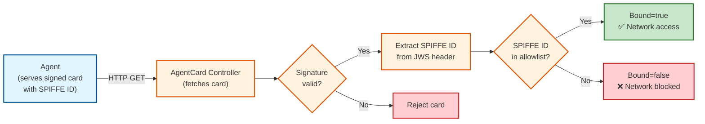

# AgentCard → Workload Identity Binding Setup Guide

**RFC (full design details):** [AgentCard → Workload Identity Binding (Step 1)](https://docs.google.com/document/d/1sOpE9tcw-DlG4Gi31t8e_CV15lNwpZ-NyA2OCDeZZEU/edit?usp=sharing)

This guide walks you through setting up AgentCard workload identity binding. By the end, you'll have a working system where AgentCards are **bound to workload identities** using SPIFFE IDs embedded in JWS signatures.

> **Note:** Identity binding works together with signature verification. The SPIFFE ID is extracted from the JWS protected header during signature verification and checked against an allowlist. When both are configured, an agent must pass **both** checks to get network access.

---

## Table of Contents

1. [Overview](#1-overview)
2. [Prerequisites](#2-prerequisites)
3. [Architecture](#3-architecture)
4. [Setup](#4-setup)
5. [Demo Scenarios](#5-demo-scenarios)
6. [Troubleshooting](#6-troubleshooting)
7. [Reference](#7-reference)
8. [Cleanup](#8-cleanup)

---

## 1. Overview

**Kagenti Operator** is a Kubernetes operator that manages AI agents following the [A2A Protocol](https://a2a-protocol.org/). Agents discover each other by publishing an **AgentCard** (a JSON document describing the agent's capabilities).

### What Identity Binding Provides

| Without Identity Binding | With Identity Binding |
|--------------------------|----------------------|
| Any workload with a valid signature can communicate | Only workloads with matching SPIFFE IDs in the allowlist get network access |

### Key Features

- **Cryptographic identity**: SPIFFE ID embedded in the JWS protected header during signing
- **Allowlist enforcement**: Only agents whose SPIFFE ID matches the allowlist are bound
- **NetworkPolicy enforcement**: Network-level isolation when binding fails
- **Operational visibility**: Kubernetes Events and status conditions for monitoring

---

## 2. Prerequisites

| Tool | Version | Verify |
|------|---------|--------|
| kubectl | v1.28+ | `kubectl version --client` |
| helm | v3.0+ | `helm version` |
| openssl | any | `openssl version` |
| python3 | 3.8+ | `python3 --version` |
| jq | any | `jq --version` |
| Docker/Podman | any | `docker version` |

**Python packages** (for signing):
```bash
pip3 install cryptography
```

**Kubernetes cluster options:**
- **Local:** kind, minikube, k3d, or Docker Desktop
- **Cloud:** EKS, GKE, AKS, OpenShift

**Clone the repository:**

```bash
git clone https://github.com/kagenti/kagenti-operator.git
cd kagenti-operator
```

> All commands assume you're in the `kagenti-operator` directory.

---

## 3. Architecture

### High-Level Flow



### How SPIFFE ID Binding Works

The SPIFFE ID used for binding comes **exclusively** from the JWS protected header `spiffe_id` claim, which is cryptographically bound to the signature. This ensures all identity claims are backed by the signing key — no fallback paths, no weaker alternatives.

**To embed the SPIFFE ID during signing:**
```bash
python3 kagenti-operator/scripts/sign-agent-card.py card.json key.pem \
  --key-id my-key --spiffe-id spiffe://cluster.local/ns/demo/sa/my-sa
```

If the card is not signed with `--spiffe-id`, binding fails with a clear error message.

### SPIFFE ID Format

```
spiffe://<trust-domain>/ns/<namespace>/sa/<serviceAccount>
```

**Example:**
```
spiffe://cluster.local/ns/demo/sa/weather-sa
```

### Enforcement Model

When identity binding is configured alongside signature verification:
- **Both** signature AND binding must pass for the `signature-verified=true` label
- NetworkPolicy uses this label to allow/block inter-agent traffic
- Failed binding → label removed → NetworkPolicy blocks network access

### Component Responsibilities

| Component | Code Location |
|-----------|---------------|
| AgentCardReconciler (binding evaluation) | `internal/controller/agentcard_controller.go` |
| Signature Verifier (extracts SPIFFE ID) | `internal/signature/verifier.go` |
| NetworkPolicy Controller | `internal/controller/agentcard_networkpolicy_controller.go` |
| Signing Script | `scripts/sign-agent-card.py` |

---

## 4. Setup

### Step 1: Install Dependencies

```bash
# Create cluster (skip if you have one)
kind create cluster --name kagenti-demo

# Install cert-manager (for webhook certificates)
kubectl apply -f https://github.com/cert-manager/cert-manager/releases/download/v1.16.2/cert-manager.yaml
kubectl wait --for=condition=Available deployment/cert-manager -n cert-manager --timeout=120s
```

### Step 2: Generate Keys and Create Secret

```bash
# Generate RSA key pair
openssl genrsa -out private-key.pem 2048
openssl rsa -in private-key.pem -pubout -out public-key.pem

# Create namespace and secret
kubectl create namespace kagenti-system
kubectl label namespace kagenti-system control-plane=kagenti-operator
kubectl create secret generic a2a-public-keys \
  --from-file=public.pem=public-key.pem \
  --from-file=my-signing-key=public-key.pem \
  --namespace=kagenti-system
```

> ⚠️ **Security:** Keep `private-key.pem` secure. Never commit it to git.

### Step 3: Install Kagenti Operator

```bash
# Build the operator (runs in a subshell so we stay in the repo root)
(cd kagenti-operator && make docker-build IMG=kagenti-operator:dev)
kind load docker-image kagenti-operator:dev --name kagenti-demo

kubectl create namespace kagenti-system 2>/dev/null || true
helm install kagenti-operator charts/kagenti-operator \
  --namespace kagenti-system \
  --set signatureVerification.enabled=true \
  --set signatureVerification.provider=secret \
  --set signatureVerification.secret.name=a2a-public-keys \
  --set signatureVerification.secret.namespace=kagenti-system \
  --set signatureVerification.enforceNetworkPolicies=true \
  --set controllerManager.container.image.repository=kagenti-operator \
  --set controllerManager.container.image.tag=dev \
  --set controllerManager.container.cmd=/manager

# Verify
kubectl wait --for=condition=Available deployment/kagenti-controller-manager \
  -n kagenti-system --timeout=120s
kubectl logs -n kagenti-system deployment/kagenti-controller-manager | head -20
```

> **Note:** `--set controllerManager.container.cmd=/manager` is required for locally-built images. Production releases use `/ko-app/cmd`.

### Step 4: Sign and Deploy Agent

```bash
kubectl create namespace demo
kubectl create serviceaccount weather-sa -n demo

# Create the agent card JSON
cat > weather-agent-card.json << 'EOF'
{
  "name": "Weather Agent",
  "description": "Provides weather information for any location",
  "version": "1.0.0",
  "url": "http://weather-agent.demo.svc.cluster.local:8000",
  "capabilities": {"streaming": true, "pushNotifications": false},
  "defaultInputModes": ["text/plain"],
  "defaultOutputModes": ["application/json"]
}
EOF

# Sign with private key + embed SPIFFE ID in JWS protected header
python3 kagenti-operator/scripts/sign-agent-card.py weather-agent-card.json private-key.pem \
  --key-id my-signing-key \
  --spiffe-id spiffe://cluster.local/ns/demo/sa/weather-sa \
  --output signed-weather-card.json

# Create ConfigMap from signed card
cat > weather-configmap.yaml << EOF
apiVersion: v1
kind: ConfigMap
metadata:
  name: weather-agent-card
  namespace: demo
data:
  agent.json: |
$(cat signed-weather-card.json | sed 's/^/    /')
EOF

kubectl apply -f weather-configmap.yaml

# Deploy Deployment + Service + AgentCard (no legacy Agent CRD)
cat <<EOF | kubectl apply -f -
apiVersion: apps/v1
kind: Deployment
metadata:
  name: weather-agent
  namespace: demo
  labels:
    app: weather-agent
    kagenti.io/type: agent
    kagenti.io/protocol: a2a
spec:
  replicas: 2
  selector:
    matchLabels:
      app: weather-agent
  template:
    metadata:
      labels:
        app: weather-agent
        kagenti.io/type: agent
    spec:
      serviceAccountName: weather-sa
      initContainers:
      - name: setup-agentcard
        image: python:3.11-slim
        command: ["sh", "-c", "mkdir -p /app/.well-known && cp /data/agent.json /app/.well-known/agent.json"]
        volumeMounts:
        - name: card
          mountPath: /data
          readOnly: true
        - name: app-dir
          mountPath: /app
      containers:
      - name: agent
        image: python:3.11-slim
        command: ["python3", "-m", "http.server", "8000"]
        workingDir: /app
        volumeMounts:
        - name: app-dir
          mountPath: /app
      volumes:
      - name: card
        configMap:
          name: weather-agent-card
      - name: app-dir
        emptyDir: {}
---
apiVersion: v1
kind: Service
metadata:
  name: weather-agent
  namespace: demo
spec:
  selector:
    app: weather-agent
  ports:
    - name: http
      port: 8000
      protocol: TCP
      targetPort: 8000
---
apiVersion: agent.kagenti.dev/v1alpha1
kind: AgentCard
metadata:
  name: weather-card
  namespace: demo
spec:
  syncPeriod: "30s"
  targetRef:
    apiVersion: apps/v1
    kind: Deployment
    name: weather-agent
  identityBinding:
    allowedSpiffeIDs:
      - "spiffe://cluster.local/ns/demo/sa/weather-sa"
EOF

# Wait for Deployment readiness
kubectl wait --for=condition=Available deployment/weather-agent -n demo --timeout=120s
kubectl wait --for=jsonpath='.status.lastSyncTime' agentcard/weather-card -n demo --timeout=60s
```

### Step 5: Verify Successful Binding

```bash
# Check binding status
kubectl get agentcard weather-card -n demo -o jsonpath='{.status.bindingStatus}' | jq .
```

**Expected:**
```json
{
  "bound": true,
  "reason": "Bound",
  "message": "SPIFFE ID spiffe://cluster.local/ns/demo/sa/weather-sa (source: jws-protected-header) is in the allowlist",
  "lastEvaluationTime": "2026-..."
}
```

```bash
# Check the SPIFFE ID used for binding (stored at status level, not inside bindingStatus)
kubectl get agentcard weather-card -n demo -o jsonpath='{.status.expectedSpiffeID}'
# Expected: spiffe://cluster.local/ns/demo/sa/weather-sa

# Check combined status
kubectl get agentcard weather-card -n demo -o jsonpath='{.status.validSignature}'
# Expected: true

kubectl get agentcard weather-card -n demo -o jsonpath='{.status.signatureIdentityMatch}'
# Expected: true

kubectl get agentcard weather-card -n demo -o jsonpath='{.status.signatureSpiffeId}'
# Expected: spiffe://cluster.local/ns/demo/sa/weather-sa

# Verify the signature-verified label is on the pods
kubectl get pods -n demo -l app=weather-agent --show-labels | grep signature-verified
# Expected: agent.kagenti.dev/signature-verified=true
```

✅ **Setup complete.** The agent's SPIFFE ID (from the JWS protected header) matches the allowlist. Signature and binding both pass → network access granted.

---

## 5. Demo Scenarios

All demos build on the `weather-agent` from Setup.

### Demo 1: Identity Mismatch (Network Blocked)

Change the allowlist to a wrong SPIFFE ID — the agent's signed SPIFFE ID no longer matches:

```bash
kubectl patch agentcard weather-card -n demo --type=merge -p '
{
  "spec": {
    "identityBinding": {
      "allowedSpiffeIDs": ["spiffe://cluster.local/ns/other/sa/wrong-sa"]
    }
  }
}'
sleep 5

# Check binding - should be false
kubectl get agentcard weather-card -n demo -o jsonpath='{.status.bindingStatus}' | jq .
```

**Expected:**
```json
{
  "bound": false,
  "reason": "NotBound",
  "message": "SPIFFE ID spiffe://cluster.local/ns/demo/sa/weather-sa (source: jws-protected-header) is not in the allowlist",
  "lastEvaluationTime": "2026-..."
}
```

```bash
# SignatureIdentityMatch is false (signature valid but binding failed)
kubectl get agentcard weather-card -n demo -o jsonpath='{.status.signatureIdentityMatch}'
# Expected: false

# Wait for the Deployment rollout (label removal triggers new pod template)
kubectl rollout status deployment/weather-agent -n demo --timeout=60s

# The signature-verified label has been REMOVED from pods
kubectl get pods -n demo -l app=weather-agent --show-labels | grep signature-verified
# Expected: no results (label removed)

# NetworkPolicy is now restrictive — other agents cannot reach this agent
kubectl get networkpolicy -n demo
kubectl logs -n kagenti-system deployment/kagenti-controller-manager | grep -i "binding\|network" | tail -5
```

**Key Takeaway:** Even though the signature is cryptographically valid, the SPIFFE ID doesn't match the allowlist → binding fails → label removed → NetworkPolicy blocks traffic. Both checks must pass.

---

### Demo 2: Fix Binding (Automatic Restoration)

Restore the correct SPIFFE ID in the allowlist:

```bash
kubectl patch agentcard weather-card -n demo --type=merge -p '
{
  "spec": {
    "identityBinding": {
      "allowedSpiffeIDs": ["spiffe://cluster.local/ns/demo/sa/weather-sa"]
    }
  }
}'
sleep 5

# Binding now passes
kubectl get agentcard weather-card -n demo -o jsonpath='{.status.bindingStatus}' | jq .
```

**Expected:**
```json
{
  "bound": true,
  "reason": "Bound",
  "message": "SPIFFE ID spiffe://cluster.local/ns/demo/sa/weather-sa (source: jws-protected-header) is in the allowlist",
  "lastEvaluationTime": "2026-..."
}
```

```bash
# SignatureIdentityMatch restored
kubectl get agentcard weather-card -n demo -o jsonpath='{.status.signatureIdentityMatch}'
# Expected: true

# Wait for the Deployment rollout (label restoration triggers new pod template)
kubectl rollout status deployment/weather-agent -n demo --timeout=60s

# Label is back on pods
kubectl get pods -n demo -l app=weather-agent --show-labels | grep signature-verified
# Expected: agent.kagenti.dev/signature-verified=true

# Events show the binding was re-evaluated
kubectl get events -n demo --sort-by='.lastTimestamp' | grep -i binding | tail -3
```

**Key Takeaway:** When the allowlist is corrected, the controller automatically re-evaluates binding, restores the label, and NetworkPolicy allows traffic again. No manual intervention needed.

---

## 6. Troubleshooting

| Issue | Cause | Solution |
|-------|-------|----------|
| `"No SPIFFE ID in JWS protected header"` | Card signed without `--spiffe-id` | Re-sign the card with `--spiffe-id` to embed the workload identity |
| `"not in the allowlist"` | SPIFFE ID doesn't match any entry in `allowedSpiffeIDs` | Check the SPIFFE ID format matches exactly |
| `bindingStatus` is nil | No `identityBinding` configured in AgentCard spec | Add `spec.identityBinding` to the AgentCard |
| Label not on pods | Signature verification not enabled | Install operator with `signatureVerification.enabled=true` |
| NetworkPolicy not blocking | NetworkPolicy enforcement not enabled | Set `signatureVerification.enforceNetworkPolicies=true` |
| `"WorkloadNotFound"` | `targetRef` points to non-existent Deployment | Verify Deployment name matches `targetRef.name` |
| `"NotAgentWorkload"` | Deployment missing `kagenti.io/type=agent` label | Add the label to the Deployment metadata |
| `"NoProtocol"` | Deployment missing `kagenti.io/protocol` label | Add `kagenti.io/protocol: a2a` to the Deployment metadata |

**Debug commands:**

```bash
# Check operator logs
kubectl logs -n kagenti-system deployment/kagenti-controller-manager | grep -i binding

# Check events
kubectl get events -n <namespace> --sort-by='.lastTimestamp' | grep -i binding

# Check full AgentCard status
kubectl get agentcard <name> -n <namespace> -o yaml

# Check pod labels
kubectl get pods -n <namespace> -l <app-label> --show-labels

# Check NetworkPolicies
kubectl get networkpolicy -n <namespace>
```

---

## 7. Reference

### AgentCard Identity Binding Fields

```yaml
spec:
  targetRef:
    apiVersion: apps/v1
    kind: Deployment
    name: my-agent
  identityBinding:
    allowedSpiffeIDs:                   # Required
      - "spiffe://cluster.local/ns/demo/sa/my-sa"
```

### Signing with SPIFFE ID

```bash
# Embed SPIFFE ID in JWS protected header (required for identity binding)
python3 kagenti-operator/scripts/sign-agent-card.py card.json private-key.pem \
  --key-id my-key \
  --spiffe-id spiffe://cluster.local/ns/demo/sa/my-sa
```

### Required Deployment Labels

```yaml
metadata:
  labels:
    kagenti.io/type: agent          # Required — identifies this as an agent workload
    kagenti.io/protocol: a2a        # Required — protocol for card fetching
```

### Status Fields

| Field | Description |
|-------|-------------|
| `status.validSignature` | `true` if JWS signature verified |
| `status.signatureSpiffeId` | SPIFFE ID extracted from JWS protected header (if present and signature valid) |
| `status.signatureIdentityMatch` | `true` only when BOTH signature AND binding pass |
| `status.expectedSpiffeID` | SPIFFE ID used for binding evaluation (from JWS protected header) |
| `status.bindingStatus.bound` | `true` if SPIFFE ID in allowlist |
| `status.bindingStatus.reason` | `Bound`, `NotBound`, `WorkloadNotFound` |
| `conditions[type=SignatureVerified]` | `True`/`False` with reason |
| `conditions[type=Bound]` | `True`/`False` with binding result |

### Helm Values for Identity Binding

Identity binding requires signature verification to be enabled for enforcement:

| Parameter | Description | Required |
|-----------|-------------|----------|
| `signatureVerification.enabled` | Enable signature verification | Yes |
| `signatureVerification.provider` | `secret` or `jwks` | Yes |
| `signatureVerification.secret.name` | Secret with public keys | Yes (if provider=secret) |
| `signatureVerification.secret.namespace` | Secret namespace | Yes (if provider=secret) |
| `signatureVerification.enforceNetworkPolicies` | Enable NetworkPolicy enforcement | Recommended |

### Kubernetes Events

| Event | Description |
|-------|-------------|
| `BindingEvaluated` | Binding check passed |
| `BindingFailed` | SPIFFE ID not in allowlist or no SPIFFE ID in JWS header |
| `SignatureEvaluated` | Signature verified successfully |
| `SignatureFailed` | Signature verification failed |

### Controller Ownership

| Controller | Responsibilities |
|------------|------------------|
| AgentCard Controller | Verify signature, extract SPIFFE ID, evaluate binding, propagate labels |
| NetworkPolicy Controller | Create permissive/restrictive policies based on `signature-verified` label |

---

## 8. Cleanup

```bash
kubectl delete namespace demo
helm uninstall kagenti-operator -n kagenti-system
kubectl delete secret a2a-public-keys -n kagenti-system
kubectl delete namespace kagenti-system
kind delete cluster --name kagenti-demo
rm -f private-key.pem public-key.pem \
     weather-agent-card.json signed-weather-card.json weather-configmap.yaml
```

---

## Summary

| What You Built | Description |
|----------------|-------------|
| Cryptographic identity binding | SPIFFE IDs from JWS headers verified against allowlist |
| Single identity source | JWS protected header only — all identity claims cryptographically bound |
| NetworkPolicy enforcement | Network-level isolation when binding or signature fails |
| Automatic restoration | Correct the allowlist → binding passes → access restored |

**Production recommendations:**
- Always sign with `--spiffe-id` to embed the identity in the JWS protected header
- Enable `enforceNetworkPolicies` for network-level enforcement
- Set up Prometheus alerts on binding failures
- When SPIRE integration lands (Step 2), the init container will automate signing with real SVIDs
