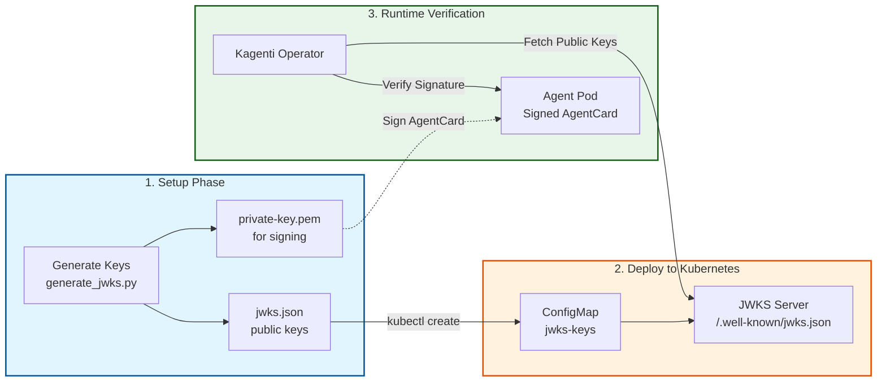

# JWKS Provider Setup Guide

Switch from Kubernetes Secrets to JWKS (JSON Web Key Set) for signature verification.

> **Prerequisites:** Complete the [A2A Signature Verification Quick Start](../../kagenti-operator/docs/a2a-signature-verification.md#quick-start) first. You should have kagenti-operator running with a weather-agent.

---

## What You'll Learn

This guide shows two ways to provide public keys for signature verification:

| Approach | When to Use | What You'll Do |
|----------|-------------|----------------|
| **Local JWKS Server** | Development, testing | Follow all 8 steps below |
| **External IdP** | Production | Skip to "Production Setup" at the end |

### Architecture Overview



**How It Works:**
1. **Setup** (Steps 1-2): Generate RSA keys - private key signs AgentCards, public key goes in JWKS
2. **Deploy** (Steps 3-4): Deploy JWKS server in Kubernetes that serves your public keys
3. **Configure** (Step 6): Point operator to JWKS server instead of Kubernetes Secret
4. **Verify** (Steps 7-8): Sign and deploy agent, confirm signature verification works

---

## Local JWKS Setup

### Step 1: Install Python Library

```bash
pip3 install --user jwcrypto
```

---

### Step 2: Generate Keys

This creates a private key for signing and a JWKS file with the public key:

```bash
cat > generate_jwks.py << 'EOF'
#!/usr/bin/env python3
import json
import argparse
from jwcrypto import jwk

def generate_jwks(key_id, key_size=2048):
    key = jwk.JWK.generate(kty='RSA', size=key_size)
    private_pem = key.export_to_pem(private_key=True, password=None)
    public_jwk = json.loads(key.export_public())
    public_jwk.update({'use': 'sig', 'alg': 'RS256', 'kid': key_id})
    
    with open('private-key.pem', 'wb') as f:
        f.write(private_pem)
    with open('jwks.json', 'w') as f:
        json.dump({"keys": [public_jwk]}, f, indent=2)
    
    print(f"✅ Generated keys with ID: {key_id}")
    print(f"   private-key.pem - Use to sign AgentCards")
    print(f"   jwks.json - Deploy to Kubernetes")

if __name__ == '__main__':
    parser = argparse.ArgumentParser()
    parser.add_argument('--key-id', default='production-key', help='Key ID')
    args = parser.parse_args()
    generate_jwks(args.key_id)
EOF

python3 generate_jwks.py --key-id production-2025
```

---

### Step 3: Store JWKS in Kubernetes

Upload the public key file to a ConfigMap:

```bash
kubectl create configmap jwks-keys \
  --from-file=jwks.json \
  -n kagenti-system \
  --dry-run=client -o yaml | kubectl apply -f -
```

---

### Step 4: Deploy JWKS Server

This server exposes your public keys at the standard `/.well-known/jwks.json` endpoint:

```bash
# Create server
cat > jwks_server.py << 'EOF'
#!/usr/bin/env python3
import json, os
from flask import Flask, jsonify

app = Flask(__name__)
JWKS_FILE = "/etc/jwks-data/jwks.json"
JWKS_DATA = {"keys": []}

def load_jwks():
    global JWKS_DATA
    if os.path.exists(JWKS_FILE):
        with open(JWKS_FILE, 'r') as f:
            JWKS_DATA = json.load(f)
        print(f"✅ Loaded {len(JWKS_DATA.get('keys', []))} key(s)")

@app.route('/.well-known/jwks.json')
def jwks():
    return jsonify(JWKS_DATA)

@app.route('/health')
def health():
    return jsonify({"status": "healthy", "keys": len(JWKS_DATA.get('keys', []))}), 200

if __name__ == '__main__':
    load_jwks()
    app.run(host='0.0.0.0', port=8080)
EOF

# Create Dockerfile
cat > Dockerfile << 'EOF'
FROM python:3.9-slim
WORKDIR /app
RUN pip install --no-cache-dir flask
COPY jwks_server.py .
EXPOSE 8080
CMD ["python3", "jwks_server.py"]
EOF

# Create deployment
cat > jwks-deployment.yaml << 'EOF'
apiVersion: v1
kind: Service
metadata:
  name: jwks-server
  namespace: kagenti-system
spec:
  selector:
    app: jwks-server
  ports:
    - port: 80
      targetPort: 8080
---
apiVersion: apps/v1
kind: Deployment
metadata:
  name: jwks-server
  namespace: kagenti-system
spec:
  replicas: 1
  selector:
    matchLabels:
      app: jwks-server
  template:
    metadata:
      labels:
        app: jwks-server
    spec:
      containers:
      - name: jwks-server
        image: jwks-server:latest
        imagePullPolicy: IfNotPresent
        ports:
        - containerPort: 8080
        volumeMounts:
        - name: jwks-data
          mountPath: /etc/jwks-data
          readOnly: true
        readinessProbe:
          httpGet:
            path: /health
            port: 8080
          initialDelaySeconds: 3
          periodSeconds: 5
      volumes:
      - name: jwks-data
        configMap:
          name: jwks-keys
EOF

# Build and deploy
docker build -t jwks-server:latest .
kind load docker-image jwks-server:latest --name agent-platform
kubectl apply -f jwks-deployment.yaml

# Wait for ready
kubectl wait --for=condition=Ready pod -l app=jwks-server -n kagenti-system --timeout=60s
echo "✅ JWKS server deployed"
```

---

### Step 5: Test JWKS Endpoint

Verify the server is working and serving your public key:

```bash
kubectl run test-jwks --rm -i --restart=Never --image=curlimages/curl -- \
  curl -s http://jwks-server.kagenti-system.svc.cluster.local/.well-known/jwks.json
```

✅ You should see JSON output with your `production-2025` key

---

### Step 6: Switch Operator to JWKS

Reconfigure the operator to fetch keys from your JWKS server instead of the Secret:

```bash
helm upgrade kagenti-operator ./charts/kagenti-operator \
  --namespace kagenti-system \
  --reuse-values \
  --set signatureVerification.provider=jwks \
  --set signatureVerification.jwks.url=http://jwks-server.kagenti-system.svc.cluster.local/.well-known/jwks.json

kubectl rollout status deployment/kagenti-controller-manager -n kagenti-system

# Important: Restart operator to immediately use JWKS (bypasses 5-minute cache)
kubectl rollout restart deployment/kagenti-controller-manager -n kagenti-system
kubectl rollout status deployment/kagenti-controller-manager -n kagenti-system

echo "✅ Operator switched to JWKS"
```

---

### Step 7: Sign and Update Agent

Now sign your AgentCard with the new private key and update the deployment:

```bash
# Sign your AgentCard and save to file
python3 << 'EOF'
import json, base64, copy
from datetime import datetime
from cryptography.hazmat.primitives import hashes, serialization
from cryptography.hazmat.primitives.asymmetric import padding
from cryptography.hazmat.backends import default_backend

agent_card = {
    "name": "Weather Agent",
    "description": "Provides weather information",
    "version": "1.0.0",
    "url": "http://weather-agent-svc.default.svc.cluster.local:8000",
    "capabilities": {"streaming": True}
}

with open('private-key.pem', 'rb') as f:
    private_key = serialization.load_pem_private_key(f.read(), password=None, backend=default_backend())

canonical = json.dumps(agent_card, sort_keys=True, separators=(',', ':'), ensure_ascii=False)
signature = private_key.sign(canonical.encode('utf-8'), padding.PKCS1v15(), hashes.SHA256())

signed = copy.deepcopy(agent_card)
signed['signature'] = {
    'algorithm': 'RS256',
    'keyId': 'production-2025',
    'value': base64.b64encode(signature).decode('utf-8'),
    'timestamp': datetime.utcnow().isoformat() + 'Z'
}

# Save to file for kubectl
with open('signed-agent.json', 'w') as f:
    json.dump(signed, f, indent=2)

print("✅ Signed AgentCard saved to signed-agent.json")
print(json.dumps(signed, indent=2))
EOF

# Update the ConfigMap with the new signature
kubectl create configmap weather-agent-card \
  --from-file=agent.json=signed-agent.json \
  -n default \
  --dry-run=client -o yaml | kubectl apply -f -

# Restart deployment to pick up new signature
kubectl rollout restart deployment weather-agent -n default

# Wait for update
sleep 15
echo "✅ Agent updated with new signature"
rm -f signed-agent.json
```

---

### Step 8: Verify Signature Verification

Check that the operator successfully verified your agent's signature using JWKS:

```bash
kubectl get agentcard -n default -o json | jq '.items[0] | {
  name: .metadata.name,
  validSignature: .status.validSignature,
  keyId: .status.signatureKeyId,
  synced: (.status.conditions[] | select(.type=="Synced") | .status)
}'
```

Expected output:
```json
{
  "name": "weather-agent-card",
  "validSignature": true,
  "keyId": "production-2025",
  "synced": "True"
}
```

✅ **Success!** Your operator is now using JWKS for signature verification.

---

## Production Setup

### Using External Identity Providers

For production, skip Steps 2-5 (no local JWKS server needed). Just configure the operator to point to your identity provider's JWKS endpoint:

**Auth0:**
```bash
helm upgrade kagenti-operator ./charts/kagenti-operator \
  --reuse-values \
  --set signatureVerification.provider=jwks \
  --set signatureVerification.jwks.url=https://YOUR_DOMAIN.auth0.com/.well-known/jwks.json
```

**Keycloak:**
```bash
helm upgrade kagenti-operator ./charts/kagenti-operator \
  --reuse-values \
  --set signatureVerification.provider=jwks \
  --set signatureVerification.jwks.url=https://keycloak.example.com/realms/YOUR_REALM/protocol/openid-connect/certs
```

**Okta:**
```bash
helm upgrade kagenti-operator ./charts/kagenti-operator \
  --reuse-values \
  --set signatureVerification.provider=jwks \
  --set signatureVerification.jwks.url=https://YOUR_DOMAIN.okta.com/oauth2/default/v1/keys
```

**Benefits:**
- ✅ Automatic key rotation
- ✅ No manual key management
- ✅ Secure HTTPS endpoints
- ✅ Enterprise-grade infrastructure

---

## Troubleshooting

### Issue: JWKS server pod not starting

**Check server logs:**
```bash
kubectl logs -n kagenti-system -l app=jwks-server
```

**Verify ConfigMap exists:**
```bash
kubectl get configmap jwks-keys -n kagenti-system -o yaml
```

---

### Issue: Signature verification still failing

**Check key ID mismatch:**
```bash
# What key ID is in your JWKS?
kubectl run check-jwks --rm -i --image=curlimages/curl -- \
  curl -s http://jwks-server.kagenti-system.svc.cluster.local/.well-known/jwks.json

# What key ID did you use to sign?
kubectl get agentcard -n default -o jsonpath='{.items[0].status.signatureKeyId}'
```

**Solution:** Both must match (e.g., `production-2025`)

---

### Issue: Operator not fetching from JWKS

**Check operator configuration:**
```bash
kubectl logs -n kagenti-system deployment/kagenti-controller-manager | grep -i jwks
```

**Look for:** "Using JWKS provider" or similar message

**If missing:** Re-run Step 6 to reconfigure the operator